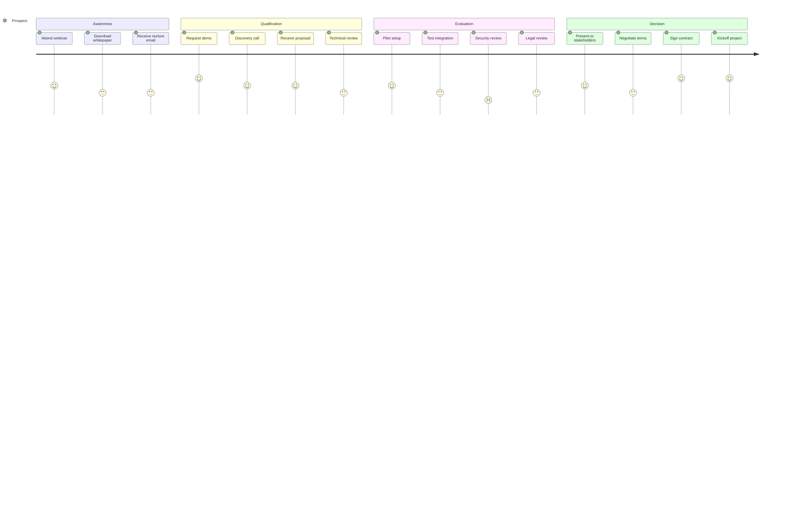
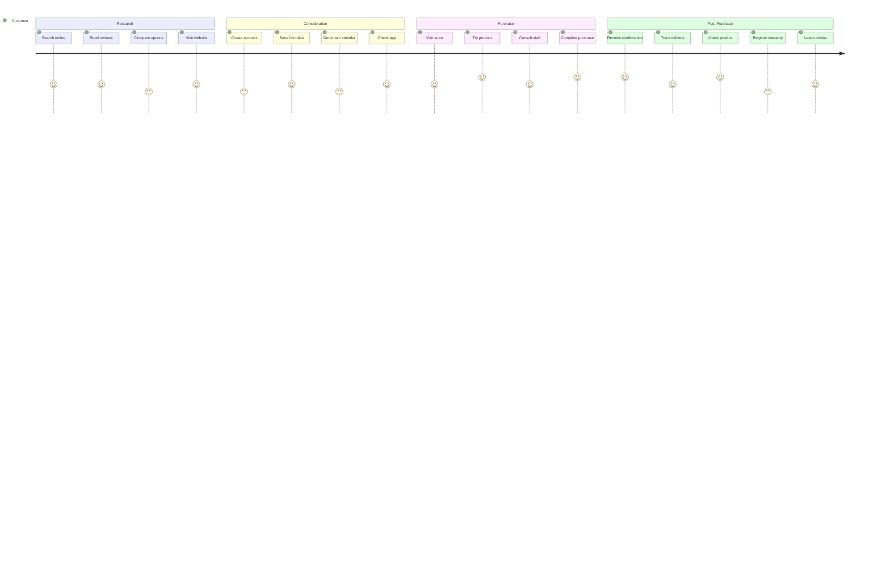
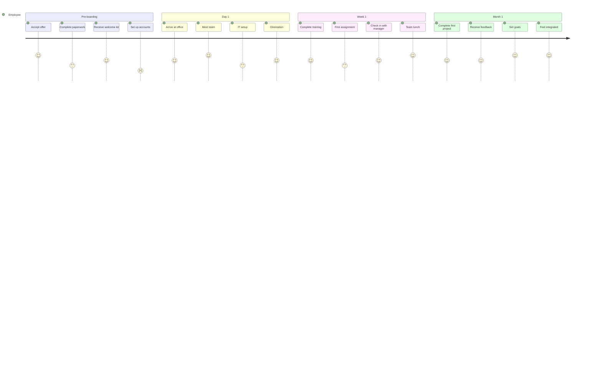
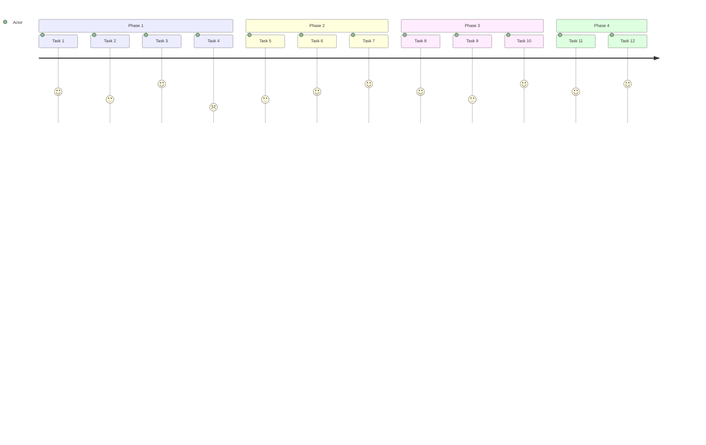

<!-- Source: https://github.com/SuperiorByteWorks-LLC/agent-project | License: Apache-2.0 | Author: Clayton Young / Superior Byte Works, LLC (Boreal Bytes) -->

# User Journey — Advanced (12–20 tasks)

Complex multi-actor journey. Use for comprehensive experience mapping and service blueprints.

---

## Example: Enterprise Sales Journey

---

## Example: Multi-Channel Experience

---

## Example: Employee Onboarding

---

## Copy-Paste Template

---

## Tips

- At 12+ tasks, consider if multiple focused journeys would be clearer
- Use sections to clearly separate journey phases
- Include multiple actors when showing handoffs
- Highlight pain points with scores of 1–2
- Consider adding callouts for improvement opportunities
