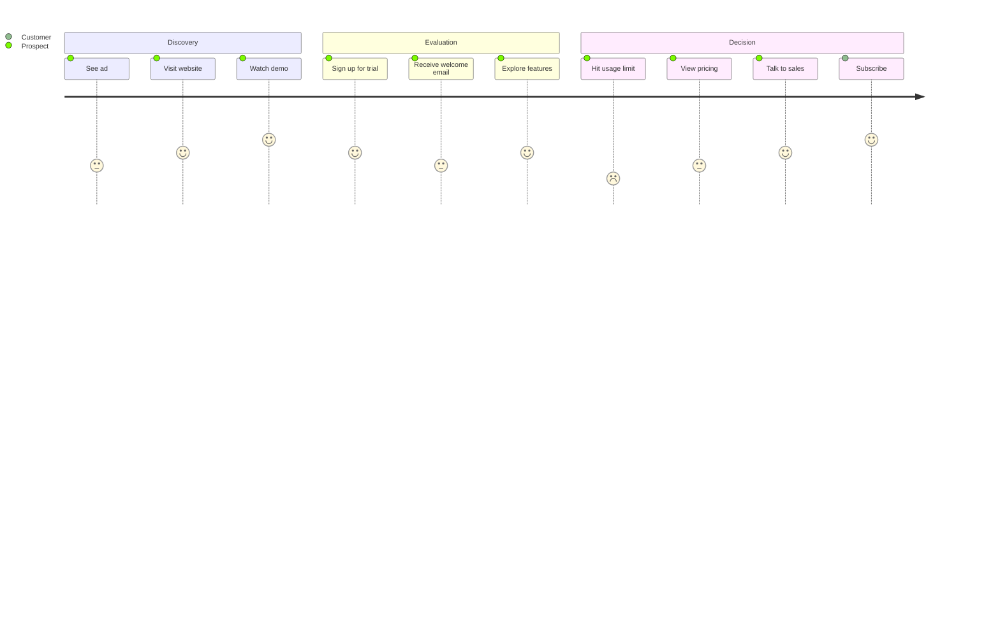
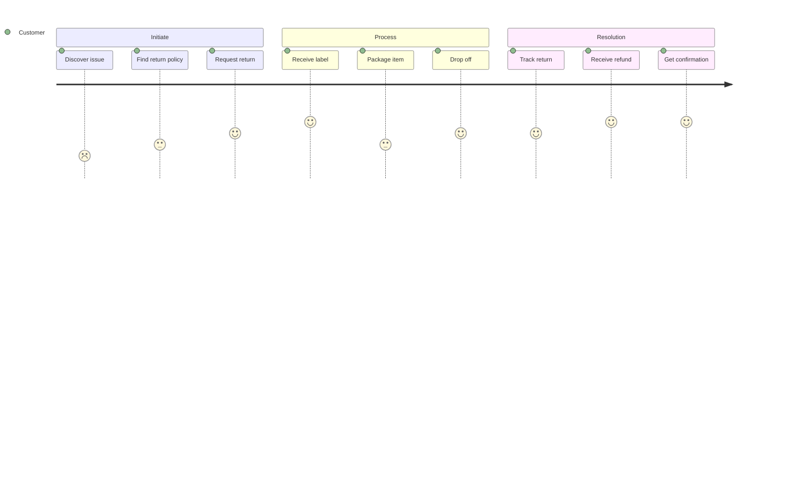
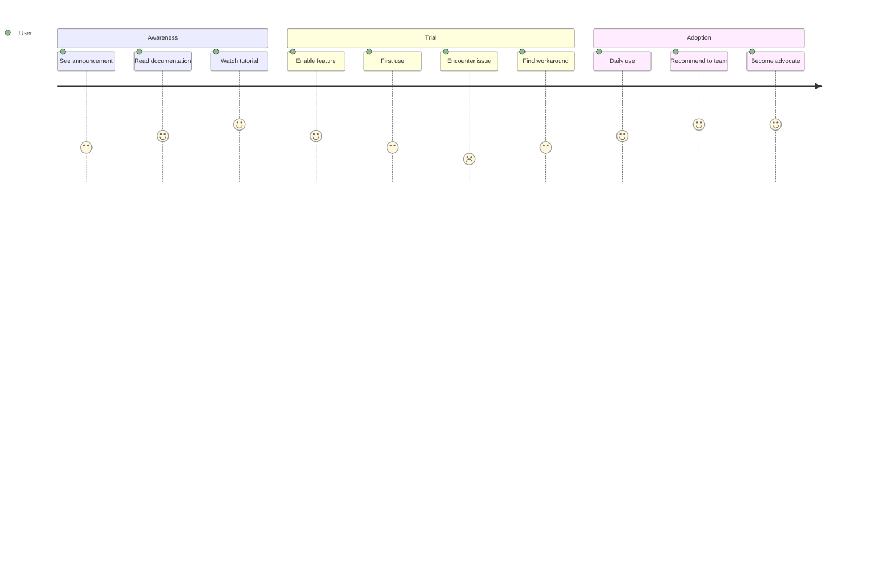
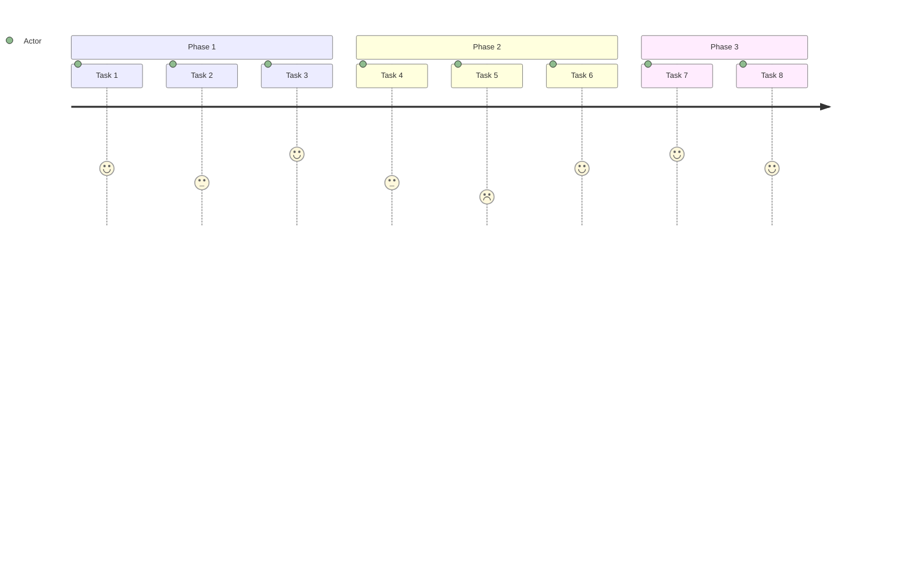

<!-- Source: https://github.com/SuperiorByteWorks-LLC/agent-project | License: Apache-2.0 | Author: Clayton Young / Superior Byte Works, LLC (Boreal Bytes) -->

# User Journey — Intermediate (6–12 tasks)

Multi-section journey. Use for complete user experiences across multiple stages.

---

## Example: SaaS Trial Journey

---

## Example: Product Return

---

## Example: Feature Adoption

---

## Copy-Paste Template

---

## Tips

- Use sections to group by journey phase
- 2–4 tasks per section is ideal
- Vary scores to show experience highs and lows
- Consider adding a second actor for system interactions
