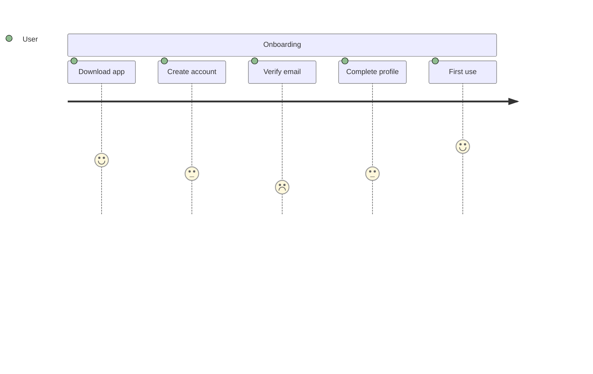
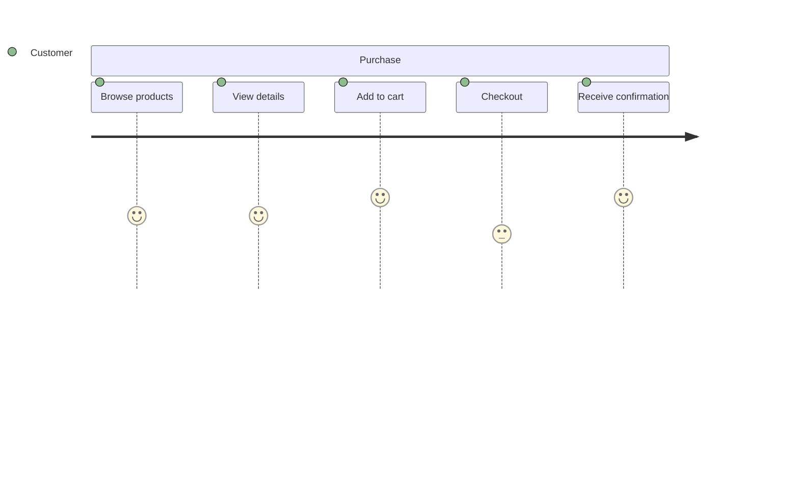
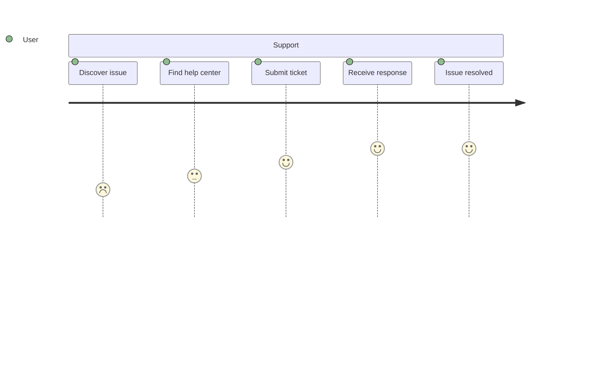
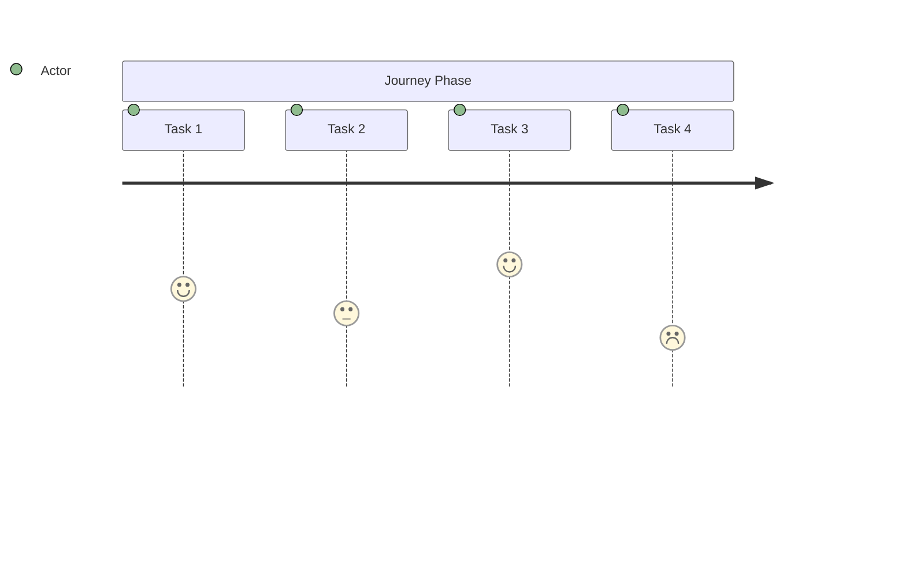

<!-- Source: https://github.com/SuperiorByteWorks-LLC/agent-project | License: Apache-2.0 | Author: Clayton Young / Superior Byte Works, LLC (Boreal Bytes) -->

# User Journey — Simple (3–6 tasks)

Single section journey. Use for basic user flows and quick experience mapping.

---

## Example: App Onboarding

---

## Example: Purchase Flow

---

## Example: Support Request

---

## Copy-Paste Template

---

## Tips

- Single section works for simple journeys
- Use scores to highlight pain points (low) and delights (high)
- 3–6 tasks covers most simple flows
- Focus on the primary actor (usually the user)
