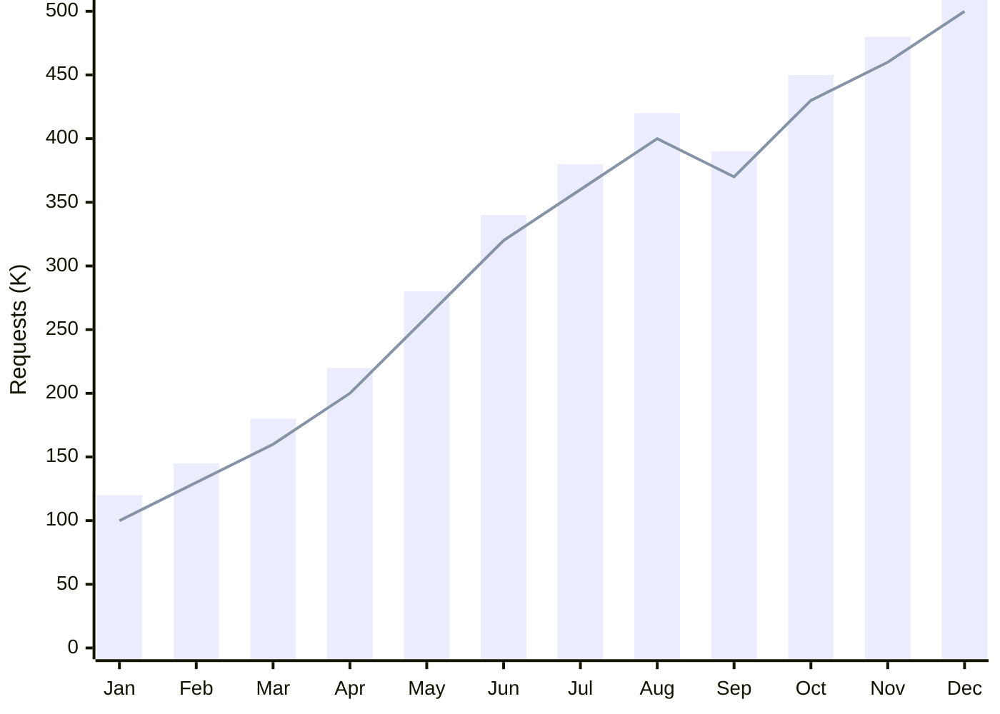

<!-- Source: https://github.com/SuperiorByteWorks-LLC/agent-project | License: Apache-2.0 | Author: Clayton Young / Superior Byte Works, LLC (Boreal Bytes) -->

# XY Chart — Advanced (3–5 series)

Complex multi-series visualizations. Use for comprehensive dashboards and detailed analysis.

---

## Example: Comprehensive Performance Dashboard



---

## Example: Multi-Product Comparison

```mermaid
xychart-beta
  accTitle: Product Line Revenue Comparison
  accDescr: Revenue comparison across five product lines over six months

  x-axis [Month_1, Month_2, Month_3, Month_4, Month_5, Month_6]
  y-axis "Revenue ($K)" 0 --> 150
  bar [45, 52, 58, 65, 72, 80]
  bar [30, 35, 42, 48, 55, 62]
  bar [25, 28, 32, 38, 42, 48]
  bar [20, 22, 25, 28, 32, 35]
  bar [15, 18, 20, 22, 25, 28]
```



---

## Example: Correlation Matrix View

```mermaid
xychart-beta
  accTitle: Feature Usage vs User Satisfaction
  accDescr: Scatter plot showing correlation between feature usage frequency and satisfaction scores

  x-axis "Usage Frequency (times/week)" 0 --> 50
  y-axis "Satisfaction Score (1-10)" 0 --> 10
  scatter [5, 8, 12, 15, 20, 25, 30, 35, 40, 45], [3, 4, 5, 6, 6, 7, 7, 8, 8, 9]
```

---

## Example: Trend Analysis with Multiple Metrics

```mermaid
xychart-beta
  accTitle: Customer Metrics Over Time
  accDescr: Comparison of new customers, churned customers, and net growth over quarters

  x-axis [Q1_2023, Q2_2023, Q3_2023, Q4_2023, Q1_2024, Q2_2024]
  y-axis "Customers (hundreds)" -5 --> 25
  bar [12, 15, 18, 22, 20, 24]
  bar [-8, -6, -7, -9, -8, -7]
  line [4, 9, 11, 13, 12, 17]
```



---

## Copy-Paste Template

```mermaid
xychart-beta
  accTitle: REPLACE WITH 3-8 WORD TITLE
  accDescr: REPLACE WITH 1-2 sentences describing what this diagram shows and what insight the reader gains

  x-axis [T1, T2, T3, T4, T5, T6, T7, T8]
  y-axis "Primary Metric" 0 --> 100

  %% Multiple data series
  bar [20, 28, 35, 42, 48, 55, 62, 70]
  bar [15, 22, 30, 38, 45, 52, 58, 65]
  bar [10, 18, 25, 32, 40, 48, 55, 60]
  line [18, 25, 32, 40, 46, 53, 60, 68]
```



---

## Tips

- Consider splitting into multiple charts if exceeding 5 series
- Use consistent visual encoding (bars for volume, lines for rates)
- Ensure all series share the same y-axis scale
- Add annotations in prose for key insights
- Use scatter plots for correlations, bars/lines for trends
- Advanced charts may need a legend or color key in accompanying text
- Consider the story: what comparison are you trying to highlight?
