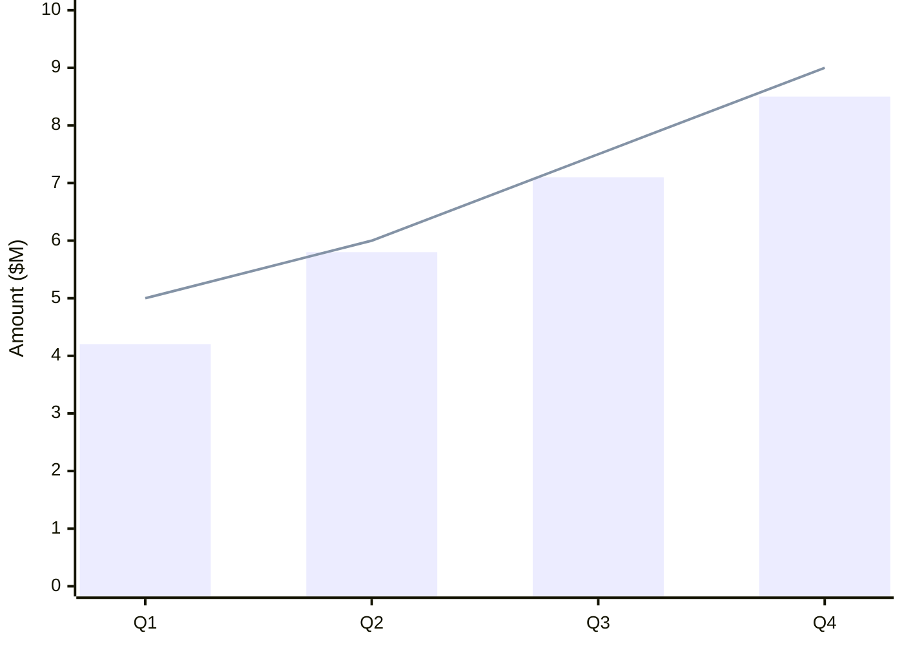
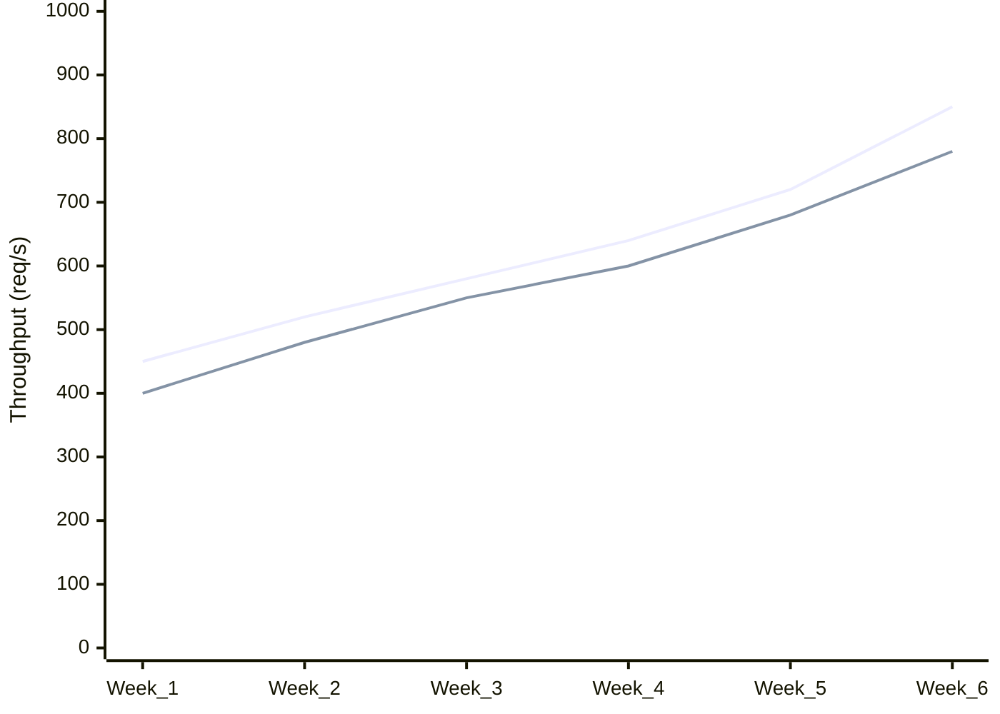
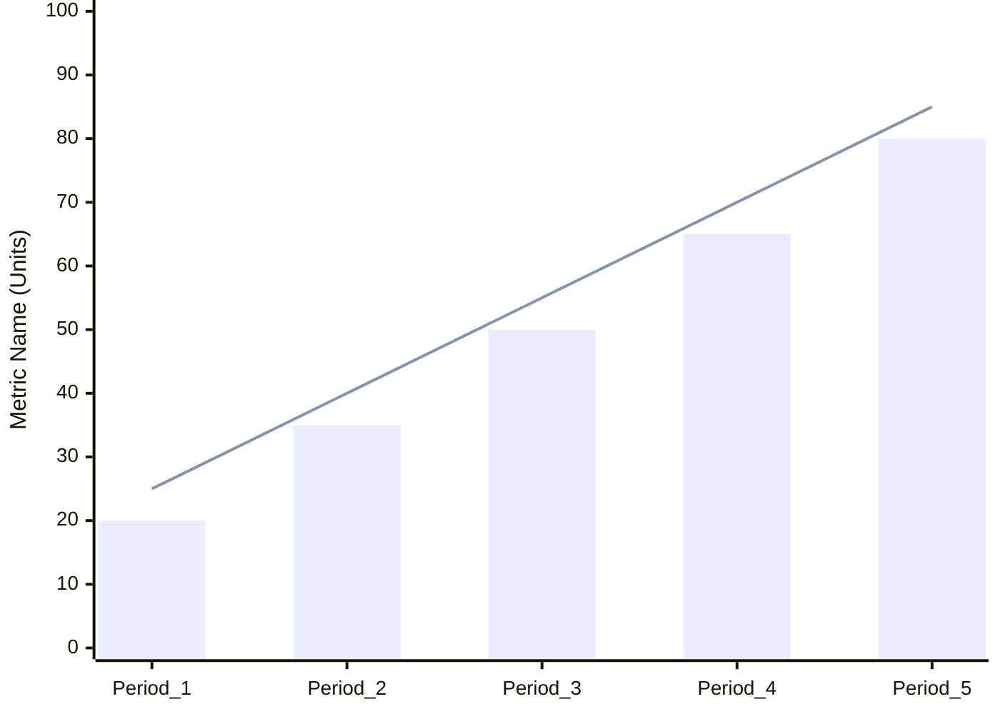

<!-- Source: https://github.com/SuperiorByteWorks-LLC/agent-project | License: Apache-2.0 | Author: Clayton Young / Superior Byte Works, LLC (Boreal Bytes) -->

# XY Chart — Intermediate (2–3 series)

Multiple data series for comparison. Use for showing relationships between different metrics.

---

## Example: Revenue vs Target



---

## Example: Multi-Region Sales

```mermaid
xychart-beta
  accTitle: Sales by Region and Quarter
  accDescr: Comparison of sales performance across three regions over four quarters

  x-axis [Q1, Q2, Q3, Q4]
  y-axis "Sales ($M)" 0 --> 8
  bar [3.2, 4.1, 5.3, 6.2]
  bar [2.8, 3.5, 4.2, 5.1]
  bar [1.9, 2.4, 3.1, 3.8]
```



---

## Example: Performance Metrics Over Time



---

## Example: Correlation Analysis

```mermaid
xychart-beta
  accTitle: Marketing Spend vs Revenue
  accDescr: Scatter plot showing relationship between marketing spend and revenue

  x-axis "Marketing Spend ($K)" 0 --> 100
  y-axis "Revenue ($K)" 0 --> 500
  scatter [10, 20, 30, 40, 50, 60, 70, 80, 90, 100], [45, 85, 120, 165, 210, 245, 290, 340, 385, 450]
```

---

## Copy-Paste Template



---

## Tips

- Use different chart types (bar + line) to distinguish series
- Keep to 2–3 series for readability
- Ensure series are comparable (same units, similar scales)
- Use consistent colors by keeping the same order
- Consider using line charts for targets/benchmarks
- Bar charts work well for actuals, lines for trends
