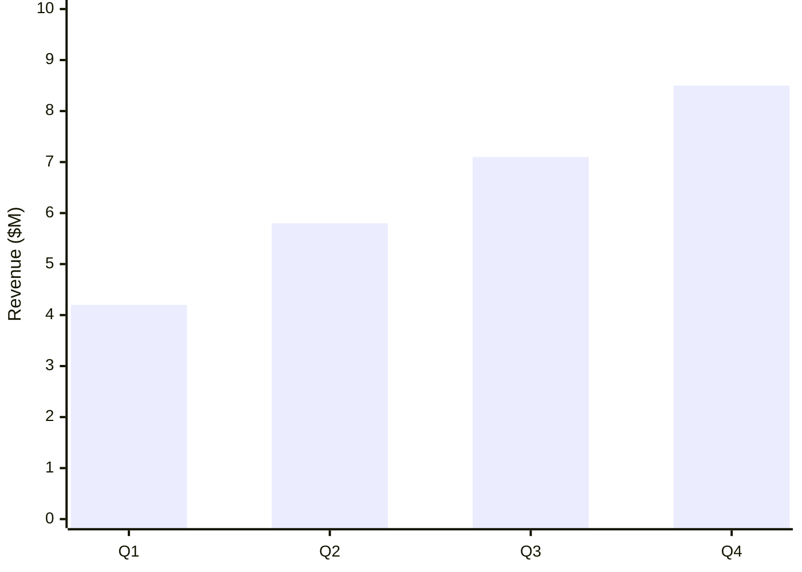
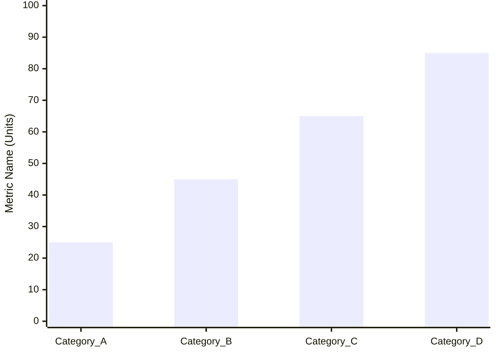

<!-- Source: https://github.com/SuperiorByteWorks-LLC/agent-project | License: Apache-2.0 | Author: Clayton Young / Superior Byte Works, LLC (Boreal Bytes) -->

# XY Chart — Simple (1 series)

Single data series. Use for showing one metric across categories or a simple trend.

---

## Example: Quarterly Revenue



---

## Example: Monthly Active Users Trend

```mermaid
xychart-beta
  accTitle: Monthly Active Users Trend
  accDescr: Line chart showing user growth over 6 months

  x-axis [Jan, Feb, Mar, Apr, May, Jun]
  y-axis "Active Users (K)" 0 --> 50
  line [12, 18, 25, 32, 41, 48]
```

---

## Example: Response Time Distribution

```mermaid
xychart-beta
  accTitle: API Response Time Distribution
  accDescr: Scatter plot showing distribution of response times

  x-axis "Request Number" 0 --> 20
  y-axis "Response Time (ms)" 0 --> 500
  scatter [1, 2, 3, 4, 5, 6, 7, 8, 9, 10, 11, 12, 13, 14, 15, 16, 17, 18, 19, 20], [120, 145, 98, 203, 156, 178, 134, 189, 167, 145, 198, 223, 156, 178, 134, 167, 189, 145, 198, 156]
```

---

## Copy-Paste Template



---

## Tips

- Use bar charts for comparing discrete categories
- Use line charts for showing trends over time
- Use scatter plots for showing distributions or correlations
- Keep axis ranges appropriate for your data
- Label axes with units for clarity
- One series keeps the message simple and focused
