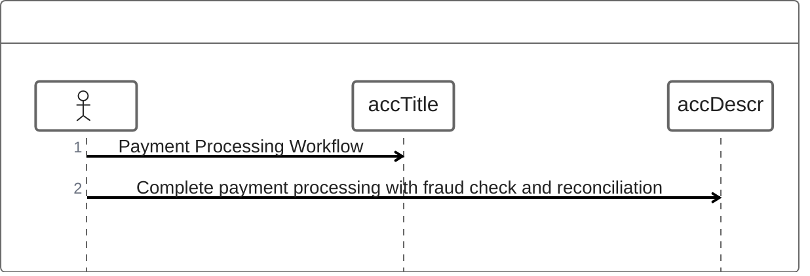
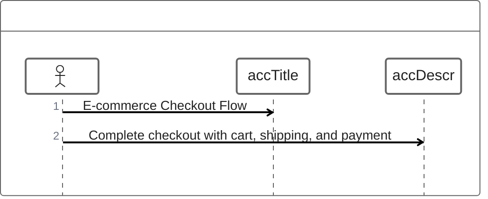
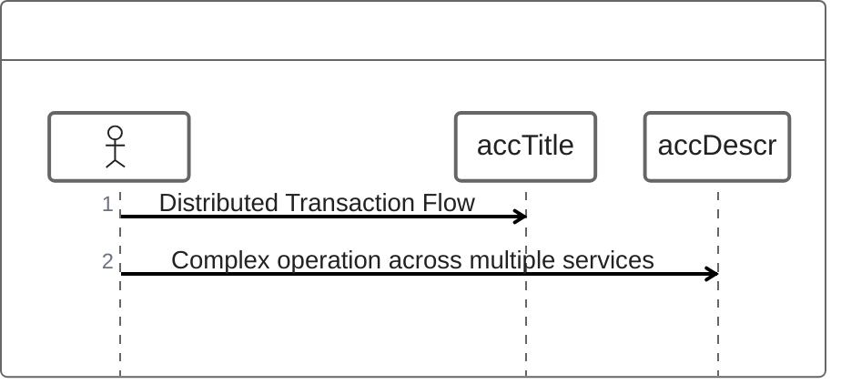
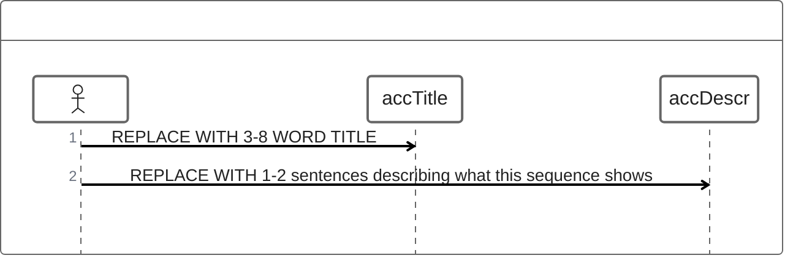

<!-- Source: https://github.com/SuperiorByteWorks-LLC/agent-project | License: Apache-2.0 | Author: Clayton Young / Superior Byte Works, LLC (Boreal Bytes) -->

# ZenUML — Advanced (12–20 messages)

Complex workflow. Use for detailed process documentation.

---

## Example: Payment Processing

---

## Example: E-commerce Checkout

---

## Example: Multi-Service Operation

---

## Copy-Paste Template

---

## Tips

- At 12+ messages, consider grouping
- Use clear service names
- Show async operations
- Include error handling paths
