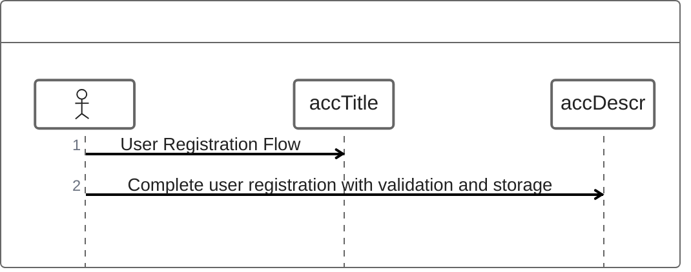
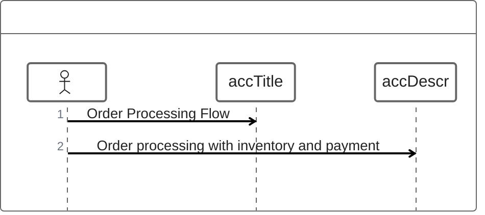
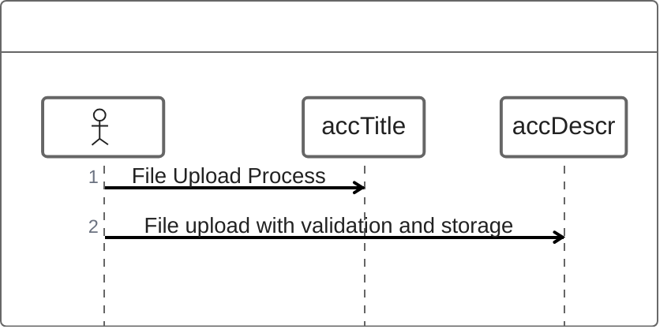
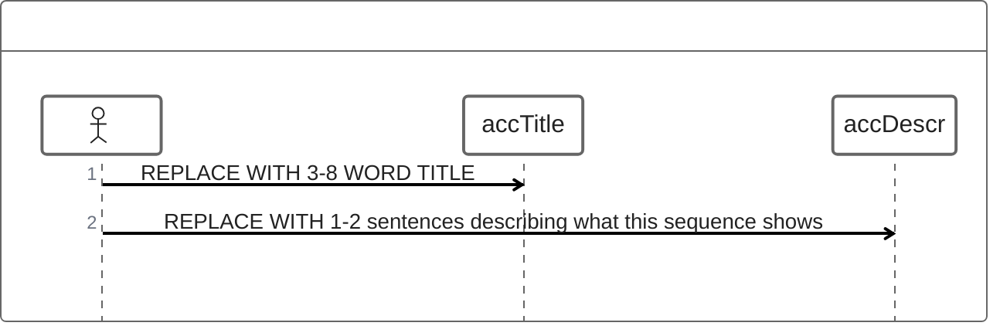

<!-- Source: https://github.com/SuperiorByteWorks-LLC/agent-project | License: Apache-2.0 | Author: Clayton Young / Superior Byte Works, LLC (Boreal Bytes) -->

# ZenUML — Intermediate (6–12 messages)

Multi-step interaction. Use for typical workflows.

---

## Example: User Registration

---

## Example: Order Processing

---

## Example: File Upload

---

## Copy-Paste Template

---

## Tips

- 6–12 messages covers most workflows
- Show self-calls with ->
- Group related operations
- Include validation steps
