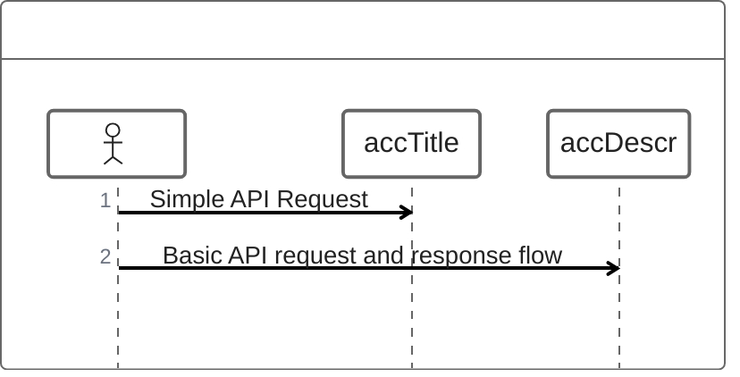
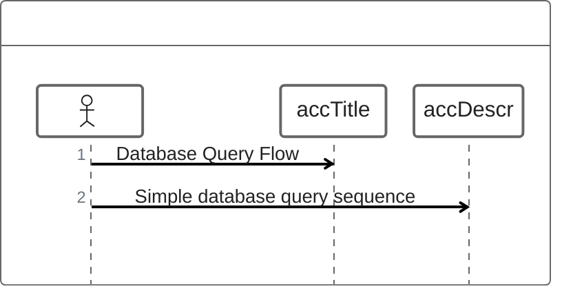
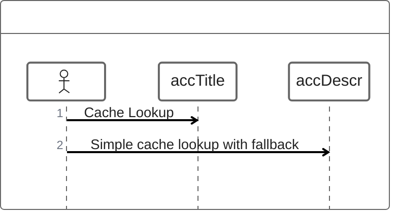
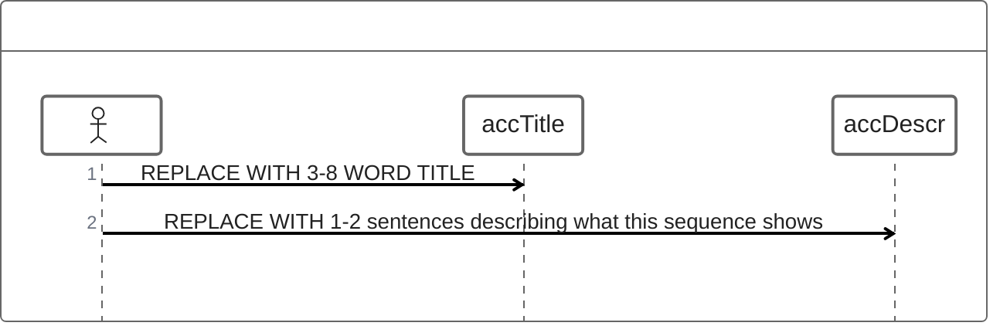

<!-- Source: https://github.com/SuperiorByteWorks-LLC/agent-project | License: Apache-2.0 | Author: Clayton Young / Superior Byte Works, LLC (Boreal Bytes) -->

# ZenUML — Simple (3–6 messages)

Basic interaction. Use for simple API calls.

---

## Example: API Call

---

## Example: Database Query

---

## Example: Cache Check

---

## Copy-Paste Template

---

## Tips

- 3–6 messages is ideal for simple flows
- Declare participants with @Type
- Use -> for request, --> for response
- Keep messages concise
