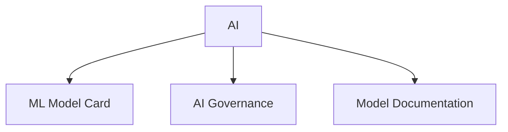

# AI

AI and machine learning model documentation templates.

## Templates

| Template                                                 | Description            |
| -------------------------------------------------------- | ---------------------- |
| [ml_model_card.md](ml_model_card.md)                     | ML model documentation |
| [ai_governance_framework.md](ai_governance_framework.md) | AI governance policies |
| [ai_model_documentation.md](ai_model_documentation.md)   | AI model specs         |

## Structure

See [Parent](../SKILL.md) for all categories.
