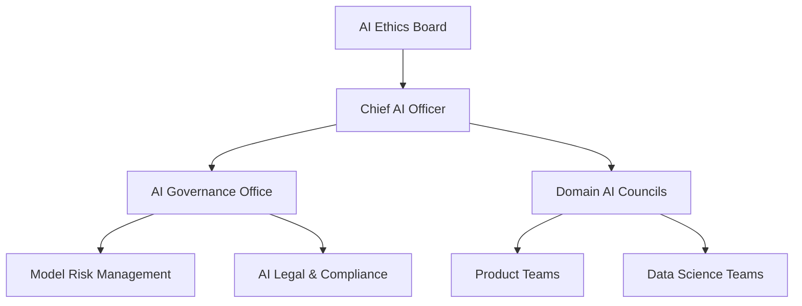
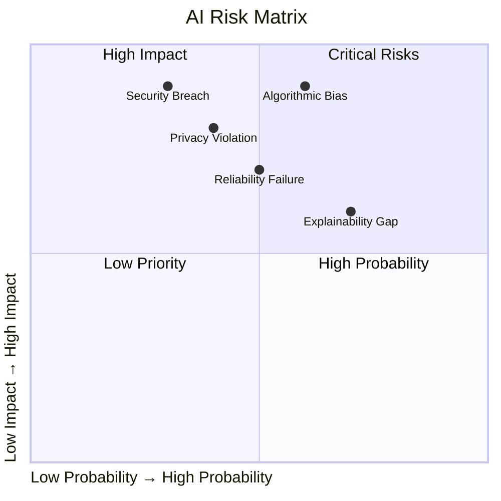
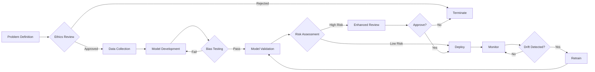

# AI Governance Framework

<!-- Organizational policies and controls for responsible AI -->

---

## Document Control

| Field              | Value                                |
| ------------------ | ------------------------------------ |
| **Framework**      | AI Governance Framework              |
| **Version**        | [X.X]                                |
| **Effective Date** | [DD-MMM-YYYY]                        |
| **Owner**          | Chief AI Officer / Data Ethics Board |
| **Review Cycle**   | Quarterly                            |

---

## AI Governance Structure



### Governance Bodies

| Body                     | Composition            | Responsibility                       | Meeting Frequency |
| ------------------------ | ---------------------- | ------------------------------------ | ----------------- |
| **AI Ethics Board**      | C-suite, Legal, Ethics | Strategic oversight, policy approval | Quarterly         |
| **Chief AI Officer**     | Executive              | Implementation, resource allocation  | Weekly            |
| **AI Governance Office** | Policy, Risk, Legal    | Day-to-day governance, standards     | Daily             |
| **Domain AI Councils**   | Domain experts         | Domain-specific governance           | Monthly           |

---

## AI Risk Framework

### Risk Categories

| Risk                    | Description                          | Impact                | Mitigation              |
| ----------------------- | ------------------------------------ | --------------------- | ----------------------- |
| **Algorithmic Bias**    | Unfair outcomes for protected groups | Reputational, Legal   | Fairness testing        |
| **Privacy Violation**   | Unauthorized data use                | Regulatory, Financial | Privacy-by-design       |
| **Security Breach**     | Model extraction, poisoning          | Operational           | Model security          |
| **Explainability Gap**  | Unexplainable decisions              | Trust, Regulatory     | XAI techniques          |
| **Reliability Failure** | Incorrect predictions                | Operational           | Monitoring, A/B testing |

### Risk Assessment Matrix

$$Risk = Probability \times Impact$$



---

## AI Development Lifecycle



### Stage Gates

| Stage                  | Gate              | Criteria                             | Approver        |
| ---------------------- | ----------------- | ------------------------------------ | --------------- |
| **Problem Definition** | Ethics checkpoint | Business case, stakeholder alignment | Product Owner   |
| **Data Collection**    | Data quality gate | Privacy compliance, data rights      | Data Steward    |
| **Model Development**  | Bias checkpoint   | Fairness metrics pass                | Data Scientist  |
| **Validation**         | Performance gate  | Meets accuracy thresholds            | Model Validator |
| **Deployment**         | Risk gate         | Risk assessment complete             | AI Governance   |
| **Monitoring**         | Drift gate        | Retrigger thresholds defined         | MLOps           |

---

## Responsible AI Principles

### FAIR Framework

| Principle          | Implementation                        | Monitoring                               |
| ------------------ | ------------------------------------- | ---------------------------------------- |
| **Fairness**       | Demographic parity, equal opportunity | Fairness metrics dashboard               |
| **Accountability** | Clear ownership, audit trails         | Model cards, logs                        |
| **Integrity**      | Security, robustness                  | Penetration testing, adversarial testing |
| **Reliability**    | Performance, drift detection          | Automated monitoring                     |

### Fairness Metrics

$$Demographic\ Parity = P(\hat{Y}=1|A=0) = P(\hat{Y}=1|A=1)$$

$$Equal\ Opportunity = P(\hat{Y}=1|Y=1,A=0) = P(\hat{Y}=1|Y=1,A=1)$$

$$Predictive\ Parity = P(Y=1|\hat{Y}=1,A=0) = P(Y=1|\hat{Y}=1,A=1)$$

| Protected Attribute | Metric             | Threshold | Status   |
| ------------------- | ------------------ | --------- | -------- |
| Gender              | Demographic Parity | Δ < 5%    | [ ] Pass |
| Age                 | Equal Opportunity  | Δ < 5%    | [ ] Pass |
| Race                | Predictive Parity  | Δ < 5%    | [ ] Pass |

---

## Model Documentation Standards

### Required Documentation

| Document              | Purpose                       | Owner          | Review Frequency |
| --------------------- | ----------------------------- | -------------- | ---------------- |
| **Model Card**        | Overview, intended use        | Data Scientist | Per version      |
| **Data Sheet**        | Training data description     | Data Engineer  | Per dataset      |
| **Validation Report** | Performance, bias testing     | Validator      | Per release      |
| **Risk Assessment**   | Identified risks, mitigations | Risk Manager   | Quarterly        |
| **Impact Assessment** | Societal impact analysis      | Ethics Board   | Annually         |

### Model Card Template

```
Model Name: [Name]
Version: [X.X.X]
Date: [YYYY-MM-DD]
Owner: [Team]

Intended Use:
- [Use case 1]
- [Use case 2]

Out of Scope:
- [Use case not supported]

Performance:
- Accuracy: [X]%
- Fairness: [X]%

Limitations:
- [Known limitation 1]
- [Known limitation 2]

Ethical Considerations:
- [Consideration 1]
```

---

## Human-in-the-Loop Requirements

### Automation Levels

| Level       | Human Involvement | Use Case            | Approval Required |
| ----------- | ----------------- | ------------------- | ----------------- |
| **Level 0** | Full automation   | Low-risk, validated | None              |
| **Level 1** | Human oversight   | Medium-risk         | Spot check        |
| **Level 2** | Human review      | High-risk           | Case-by-case      |
| **Level 3** | Human decision    | Critical decisions  | Always            |

### Escalation Triggers

| Trigger                      | Action        | Timeframe       |
| ---------------------------- | ------------- | --------------- |
| Confidence < [X]%            | Human review  | Immediate       |
| Protected attribute detected | Bias check    | Before decision |
| Anomalous pattern            | Manual review | Within 24 hrs   |
| Complaint received           | Investigation | Within 48 hrs   |

---

## Monitoring & Compliance

### Continuous Monitoring

| Metric         | Frequency | Threshold   | Action      |
| -------------- | --------- | ----------- | ----------- |
| Accuracy drift | Real-time | > -5%       | Alert       |
| Fairness drift | Daily     | Δ > 5%      | Investigate |
| Latency        | Real-time | > 100ms     | Optimize    |
| Throughput     | Real-time | < 100 req/s | Scale       |
| Error rate     | Real-time | > 1%        | Alert       |

### Compliance Checklist

- [ ] Privacy impact assessment completed
- [ ] Bias testing performed and documented
- [ ] Security review passed
- [ ] Legal approval obtained
- [ ] Audit trail configured
- [ ] Monitoring alerts set
- [ ] Incident response plan documented
- [ ] User documentation published

---

## Incident Response

### Response Playbook

| Severity     | Response Time | Team     | Actions                 |
| ------------ | ------------- | -------- | ----------------------- |
| **Critical** | 15 min        | War room | Rollback, investigation |
| **High**     | 1 hour        | On-call  | Assessment, mitigation  |
| **Medium**   | 4 hours       | Team     | Investigation, fix      |
| **Low**      | 24 hours      | Team     | Ticket, backlog         |

### Incident Categories

| Category                    | Examples                   | Response             |
| --------------------------- | -------------------------- | -------------------- |
| **Bias Incident**           | Discriminatory outcomes    | Suspend, investigate |
| **Privacy Breach**          | Unauthorized data exposure | Legal, regulatory    |
| **Security Incident**       | Model theft, poisoning     | Security team        |
| **Performance Degradation** | Accuracy drop              | Rollback, retrain    |
| **Ethics Concern**          | Stakeholder complaint      | Ethics review        |

---

## Training & Awareness

| Audience             | Training                 | Frequency   |
| -------------------- | ------------------------ | ----------- |
| **Data Scientists**  | Responsible AI practices | Quarterly   |
| **Product Managers** | AI ethics, governance    | Bi-annually |
| **Engineers**        | Secure ML, monitoring    | Quarterly   |
| **Leadership**       | AI risk, strategy        | Annually    |
| **All Employees**    | AI principles awareness  | Onboarding  |

---

## Metrics & KPIs

| Metric                 | Target  | Current | Status |
| ---------------------- | ------- | ------- | ------ |
| Models with cards      | 100%    | [X]%    | [ ]    |
| Bias tests passing     | >95%    | [X]%    | [ ]    |
| Time to detect drift   | <1 hr   | [X] min | [ ]    |
| Audit compliance       | 100%    | [X]%    | [ ]    |
| Training completion    | 100%    | [X]%    | [ ]    |
| Incident response time | <15 min | [X] min | [ ]    |

---

**Approved:**

Chief AI Officer: ********\_******** Date: ****\_****

Chief Data Officer: ********\_******** Date: ****\_****

General Counsel: ********\_******** Date: ****\_****
