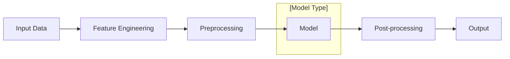
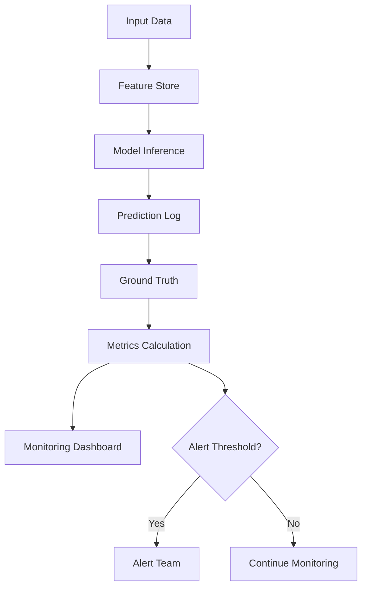
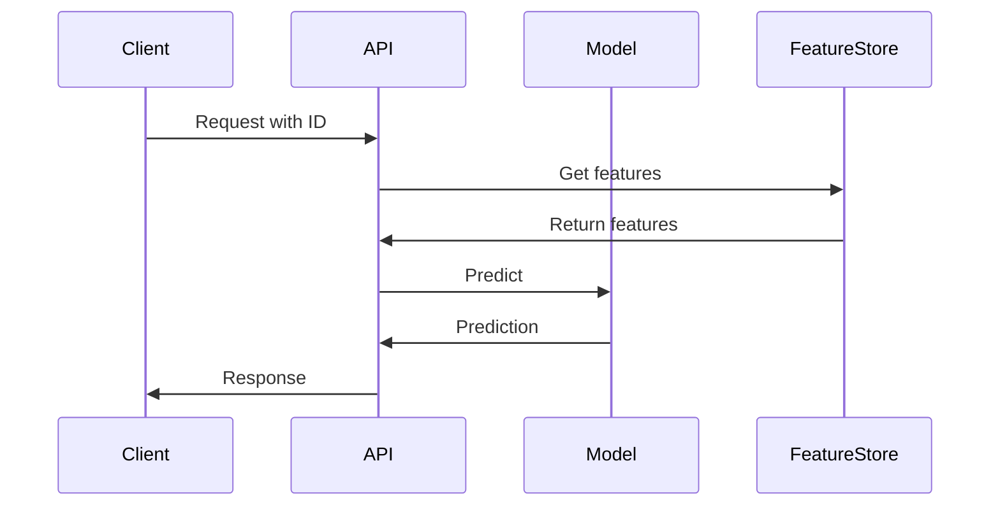

# AI Model Documentation

<!-- Comprehensive documentation for machine learning models -->

---

## Document Control

| Field            | Value                                |
| ---------------- | ------------------------------------ |
| **Model Name**   | [Model Name]                         |
| **Version**      | [X.X.X]                              |
| **Model Type**   | [Classification/Regression/NLP/etc.] |
| **Owner**        | [Team/Data Scientist]                |
| **Last Updated** | [DD-MMM-YYYY]                        |

---

## Model Overview

### Purpose

[Description of what the model does and business value]

### Model Architecture

### Model Details

| Attribute             | Value                               |
| --------------------- | ----------------------------------- |
| **Algorithm**         | [e.g., Random Forest, BERT, ResNet] |
| **Framework**         | [PyTorch/TensorFlow/scikit-learn]   |
| **Training Data**     | [Description]                       |
| **Training Period**   | [Start Date] - [End Date]           |
| **Inference Latency** | [X] ms                              |
| **Model Size**        | [X] MB                              |

---

## Performance Metrics

### Classification Metrics

$$Accuracy = \frac{TP + TN}{TP + TN + FP + FN}$$

$$Precision = \frac{TP}{TP + FP}$$

$$Recall = \frac{TP}{TP + FN}$$

$$F1 = 2 \times \frac{Precision \times Recall}{Precision + Recall}$$

| Metric    | Train | Validation | Test | Baseline |
| --------- | ----- | ---------- | ---- | -------- |
| Accuracy  | [X]%  | [X]%       | [X]% | [X]%     |
| Precision | [X]%  | [X]%       | [X]% | [X]%     |
| Recall    | [X]%  | [X]%       | [X]% | [X]%     |
| F1 Score  | [X]   | [X]        | [X]  | [X]      |
| AUC-ROC   | [X]   | [X]        | [X]  | [X]      |

### Regression Metrics

$$MSE = \frac{1}{n} \sum_{i=1}^{n} (y_i - \hat{y}_i)^2$$

$$RMSE = \sqrt{MSE}$$

$$MAE = \frac{1}{n} \sum_{i=1}^{n} |y_i - \hat{y}_i|$$

$$R^2 = 1 - \frac{\sum(y_i - \hat{y}_i)^2}{\sum(y_i - \bar{y})^2}$$

| Metric | Train | Validation | Test | Baseline |
| ------ | ----- | ---------- | ---- | -------- |
| MSE    | [X]   | [X]        | [X]  | [X]      |
| RMSE   | [X]   | [X]        | [X]  | [X]      |
| MAE    | [X]   | [X]        | [X]  | [X]      |
| R²     | [X]   | [X]        | [X]  | [X]      |

---

## Data Requirements

### Input Schema

| Feature   | Type                    | Range     | Description   |
| --------- | ----------------------- | --------- | ------------- |
| feature_1 | [float/int/categorical] | [min-max] | [Description] |
| feature_2 | [float/int/categorical] | [min-max] | [Description] |
| ...       | ...                     | ...       | ...           |

### Output Schema

| Field       | Type   | Description            |
| ----------- | ------ | ---------------------- |
| prediction  | [type] | [Description]          |
| probability | float  | Confidence score (0-1) |

### Data Quality Checks

| Check           | Threshold | Action          |
| --------------- | --------- | --------------- |
| Missing values  | < [X]%    | Reject batch    |
| Out of range    | < [X]%    | Flag for review |
| Schema mismatch | 0         | Reject batch    |

---

## Bias and Fairness

### Fairness Metrics

| Metric             | Group A | Group B | Threshold | Status   |
| ------------------ | ------- | ------- | --------- | -------- |
| Demographic Parity | [X]     | [X]     | Δ < [X]   | [ ] Pass |
| Equal Opportunity  | [X]     | [X]     | Δ < [X]   | [ ] Pass |
| Predictive Parity  | [X]     | [X]     | Δ < [X]   | [ ] Pass |

### Protected Attributes

- [ ] Age
- [ ] Gender
- [ ] Race/Ethnicity
- [ ] Location
- [ ] Other: [Specify]

### Mitigation Strategies

[Description of fairness mitigation techniques applied]

---

## Model Monitoring

### Drift Detection

| Metric           | Baseline | Current | Drift Threshold | Status |
| ---------------- | -------- | ------- | --------------- | ------ |
| Data Drift       | [X]      | [X]     | > [X]           | [ ]    |
| Concept Drift    | [X]      | [X]     | > [X]           | [ ]    |
| Prediction Drift | [X]      | [X]     | > [X]           | [ ]    |

### Performance Monitoring

### Alert Thresholds

| Metric        | Warning | Critical | Action         |
| ------------- | ------- | -------- | -------------- |
| Accuracy Drop | -[X]%   | -[X]%    | Review/Retrain |
| Latency       | [X]ms   | [X]ms    | Scale/Optimize |
| Error Rate    | [X]%    | [X]%     | Rollback       |

---

## Deployment

### Inference Pipeline

### Infrastructure

| Component   | Specification                  |
| ----------- | ------------------------------ |
| Compute     | [CPU/GPU/TPU] - [X] cores      |
| Memory      | [X] GB                         |
| Scaling     | Auto-scale [X] → [X] instances |
| Latency SLA | < [X]ms p99                    |

### Rollback Strategy

If error rate > [X]% or latency > [X]ms:

1. Route traffic to previous version
2. Alert on-call engineer
3. Investigate and fix

---

## Maintenance

### Retraining Schedule

| Trigger     | Action                     | Frequency        |
| ----------- | -------------------------- | ---------------- |
| Scheduled   | Retrain on new data        | [Weekly/Monthly] |
| Performance | Retrain if accuracy < [X]% | As needed        |
| Drift       | Retrain if drift detected  | As needed        |

### Version History

| Version | Date   | Changes       | Author |
| ------- | ------ | ------------- | ------ |
| [X.X.X] | [Date] | [Description] | [Name] |

---

## Ethical Considerations

### Impact Assessment

| Stakeholder  | Impact        | Mitigation   |
| ------------ | ------------- | ------------ |
| End Users    | [Description] | [Mitigation] |
| Organization | [Description] | [Mitigation] |
| Society      | [Description] | [Mitigation] |

### Transparency

- [ ] Model card published
- [ ] Decision explanations available
- [ ] Audit trail maintained

---

## Contact

| Role           | Name   | Email   |
| -------------- | ------ | ------- |
| Model Owner    | [Name] | [email] |
| Data Scientist | [Name] | [email] |
| ML Engineer    | [Name] | [email] |

---

**Approval:**

Data Scientist: ********\_******** Date: ****\_****

ML Engineer: ********\_******** Date: ****\_****

Compliance: ********\_******** Date: ****\_****
