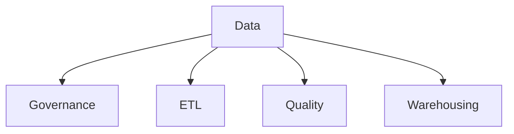

# Data

Data governance, analytics, and engineering templates.

## Templates

| Template                                                     | Description          |
| ------------------------------------------------------------ | -------------------- |
| [data_governance_framework.md](data_governance_framework.md) | Governance policies  |
| [etl_specification.md](etl_specification.md)                 | ETL documentation    |
| [data_quality_report.md](data_quality_report.md)             | Quality reporting    |
| [warehouse_schema.md](warehouse_schema.md)                   | Schema documentation |
| [data_catalog_template.md](data_catalog_template.md)         | Data cataloging      |

## Structure

See [Parent](../SKILL.md) for all categories.
