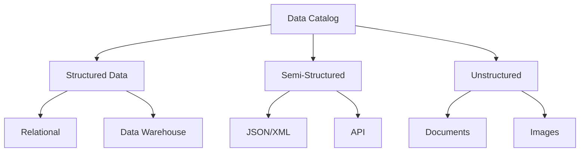
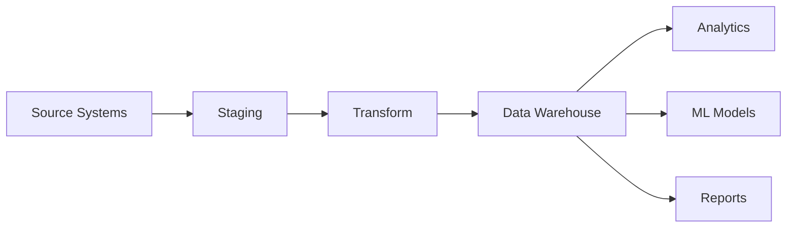

# Data Catalog Template

<!-- Inventory and metadata for data assets -->

---

## Document Control

| Field            | Value              |
| ---------------- | ------------------ |
| **Catalog**      | Data Asset Catalog |
| **Version**      | [X.X]              |
| **Last Updated** | [DD-MMM-YYYY]      |
| **Owner**        | Data Steward       |

---

## Catalog Overview

### Asset Summary

| Category        | Count | Storage | Quality Score |
| --------------- | ----- | ------- | ------------- |
| Databases       | [X]   | [X] TB  | [X]%          |
| Data Warehouses | [X]   | [X] TB  | [X]%          |
| Data Lakes      | [X]   | [X] PB  | [X]%          |
| APIs            | [X]   | N/A     | [X]%          |
| Files           | [X]   | [X] TB  | [X]%          |

---

## Data Assets

### Database Assets

| Asset Name | Type       | Owner  | Sensitivity  | Update Frequency | Quality |
| ---------- | ---------- | ------ | ------------ | ---------------- | ------- |
| [DB1]      | PostgreSQL | [Team] | Confidential | Real-time        | [X]%    |
| [DB2]      | MySQL      | [Team] | Internal     | Hourly           | [X]%    |
| [DB3]      | MongoDB    | [Team] | Public       | Daily            | [X]%    |

### Data Warehouse

| Table/View        | Schema  | Records | Size   | Last Update |
| ----------------- | ------- | ------- | ------ | ----------- |
| fact_sales        | Sales   | [X]M    | [X] GB | [Date]      |
| dim_customer      | Master  | [X]M    | [X] GB | [Date]      |
| fact_transactions | Finance | [X]B    | [X] GB | [Date]      |

### Data Lake

| Dataset        | Format  | Location             | Size   | Partitioned |
| -------------- | ------- | -------------------- | ------ | ----------- |
| raw_events     | Parquet | s3://lake/raw/       | [X] TB | Yes         |
| processed_logs | ORC     | s3://lake/processed/ | [X] TB | Yes         |
| ml_features    | Delta   | s3://lake/features/  | [X] TB | Yes         |

---

## Metadata Standards

### Required Fields

| Field                | Description         | Example                      |
| -------------------- | ------------------- | ---------------------------- |
| **Asset Name**       | Unique identifier   | customer_db_prod             |
| **Description**      | Purpose and content | Production customer database |
| **Owner**            | Responsible team    | Data Platform                |
| **Sensitivity**      | Classification      | Confidential                 |
| **Quality Score**    | Data quality %      | 98%                          |
| **Update Frequency** | How often updated   | Real-time                    |
| **Retention**        | How long retained   | 7 years                      |
| **Source**           | Origin system       | CRM                          |
| **Consumers**        | Downstream systems  | Analytics, ML                |

### Business Glossary

| Term     | Definition                                     | Domain    |
| -------- | ---------------------------------------------- | --------- |
| Customer | Individual or organization purchasing products | Sales     |
| Revenue  | Total income from sales                        | Finance   |
| Churn    | Rate of customer attrition                     | Retention |

---

## Data Lineage

| Source | Transformation     | Target        | Pipeline   |
| ------ | ------------------ | ------------- | ---------- |
| CRM    | Clean, standardize | DWH_customers | daily_etl  |
| ERP    | Aggregate          | DWH_finance   | hourly_etl |
| Web    | Parse, enrich      | DWH_behavior  | streaming  |

---

## Data Quality

### Quality Dimensions

| Dimension    | Weight   | Score    | Status  |
| ------------ | -------- | -------- | ------- |
| Completeness | 25%      | [X]%     | [ ]     |
| Accuracy     | 25%      | [X]%     | [ ]     |
| Consistency  | 20%      | [X]%     | [ ]     |
| Timeliness   | 15%      | [X]%     | [ ]     |
| Validity     | 15%      | [X]%     | [ ]     |
| **Overall**  | **100%** | **[X]%** | **[ ]** |

### Data Quality Rules

| Asset     | Rule           | Threshold | Status |
| --------- | -------------- | --------- | ------ |
| customers | email not null | 100%      | [ ]    |
| orders    | amount > 0     | 100%      | [ ]    |
| products  | price not null | 100%      | [ ]    |

---

## Access & Security

### Access Levels

| Role          | Databases | Tables   | Operations |
| ------------- | --------- | -------- | ---------- |
| Data Analyst  | Read      | All      | SELECT     |
| Data Engineer | Write     | All      | All        |
| Business User | Read      | Approved | SELECT     |
| Admin         | Full      | All      | All        |

### Data Masking

| Column | Masking Rule       | Applies To |
| ------ | ------------------ | ---------- |
| ssn    | \***\*-**-last4    | Non-admin  |
| email  | \*\*\*@domain.com  | Non-admin  |
| phone  | (**_) _**-\*\*\*\* | Non-admin  |

---

## Search & Discovery

### Search Capabilities

- Full-text search across metadata
- Filter by domain, owner, sensitivity
- Tag-based discovery
- Similarity recommendations
- Usage statistics

### Popular Assets

| Rank | Asset        | Queries/Week | Users |
| ---- | ------------ | ------------ | ----- |
| 1    | dim_customer | [X]          | [X]   |
| 2    | fact_sales   | [X]          | [X]   |
| 3    | web_events   | [X]          | [X]   |

---

## Maintenance

### Review Schedule

| Activity           | Frequency  | Owner         |
| ------------------ | ---------- | ------------- |
| Metadata update    | Continuous | Data Stewards |
| Quality assessment | Weekly     | DQ Team       |
| Access review      | Quarterly  | Security      |
| Full audit         | Annually   | Compliance    |

---

**Approved:** ********\_******** Date: ****\_****
