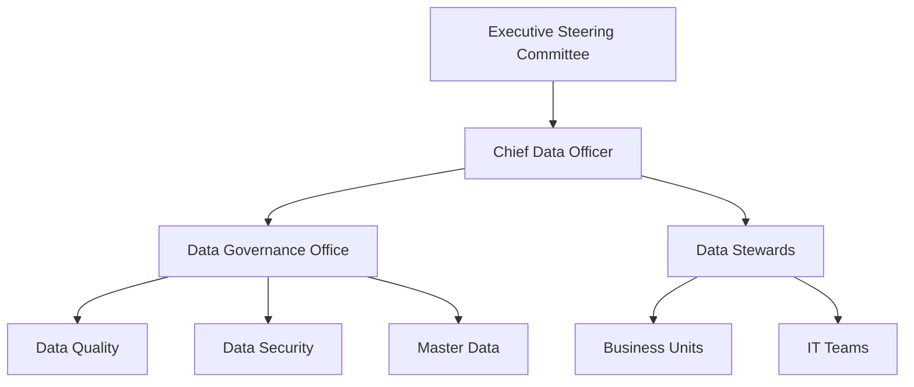

# Data Governance Framework

---

## Document Control

| Field | Value |
|-------|-------|
| **Framework** | Data Governance Framework |
| **Version** | [X.X] |
| **Owner** | Chief Data Officer |

---

## Data Governance Structure

## Data Quality Metrics

$$Data\ Quality\ Score = \frac{\sum_{i=1}^{n} w_i \times q_i}{\sum_{i=1}^{n} w_i}$$

Where:
- $w_i$ = weight of dimension $i$
- $q_i$ = quality score of dimension $i$

---

**Approved:** _________________ Date: _________
