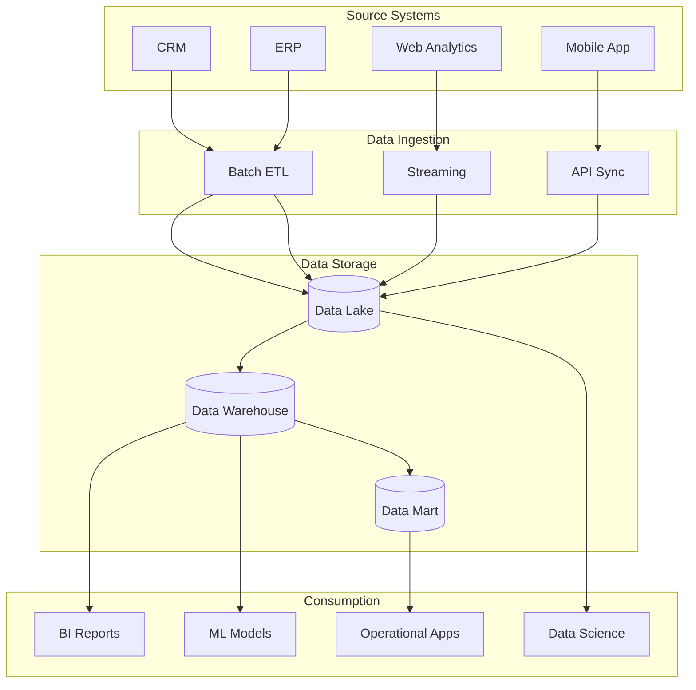
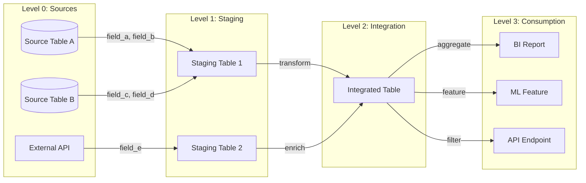
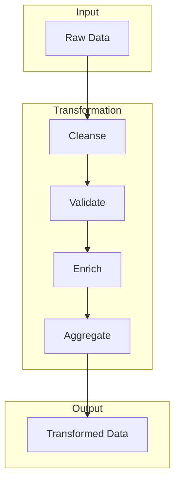
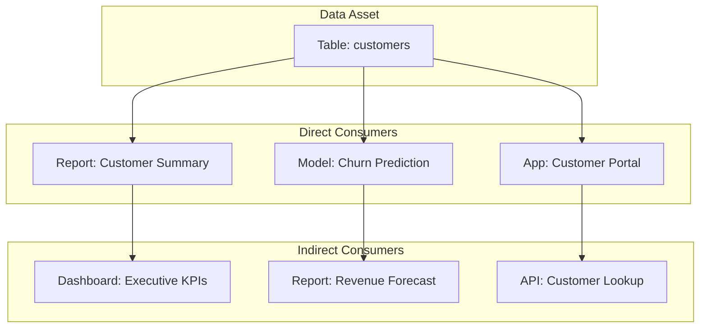
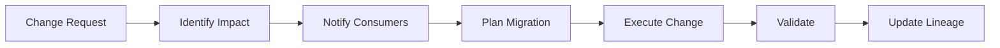

# Data Lineage Documentation

<!-- Data flow tracking and impact analysis -->

---

## Document Control

| Field            | Value                     |
| ---------------- | ------------------------- |
| **Document ID**  | DL-[YYYY]-[NNN]           |
| **Version**      | [X.Y.Z]                   |
| **Date**         | [YYYY-MM-DD]              |
| **Author**       | [Name, Role]              |
| **Data Steward** | [Name, Role]              |
| **Status**       | Draft / Review / Approved |
| **Review Cycle** | Quarterly                 |

> [!IMPORTANT]
> Data lineage is required for GDPR compliance, impact analysis, and data governance.

---

## Executive Summary

### Scope

This document traces data flow for:

- **Data Assets:** [N] tables, [N] reports, [N] APIs
- **Source Systems:** [N] systems
- **Downstream Consumers:** [N] applications, [N] teams

### Key Lineage Paths

| Path     | Complexity | Criticality |
| -------- | ---------- | ----------- |
| [Path 1] | High       | Critical    |
| [Path 2] | Medium     | High        |
| [Path 3] | Low        | Medium      |

---

## High-Level Lineage

### Enterprise Data Flow

---

## Detailed Lineage

### Lineage Path: [Data Asset Name]

#### Overview

| Attribute               | Value                                         |
| ----------------------- | --------------------------------------------- |
| **Asset Type**          | Table / View / Report / API                   |
| **Owner**               | [Team/Individual]                             |
| **Update Frequency**    | Real-time / Hourly / Daily / Weekly           |
| **Record Count**        | [N]                                           |
| **Data Classification** | Public / Internal / Confidential / Restricted |

#### Lineage Diagram

#### Field-Level Lineage

| Target Field  | Source System | Source Field          | Transformation                     |
| ------------- | ------------- | --------------------- | ---------------------------------- |
| customer_id   | CRM           | id                    | Direct mapping                     |
| customer_name | CRM           | first_name, last_name | CONCAT(first_name, ' ', last_name) |
| total_revenue | ERP           | amount                | SUM(amount) GROUP BY customer      |
| last_purchase | ERP           | order_date            | MAX(order_date)                    |

---

## Source Systems

### System: [Source Name]

| Attribute            | Value                     |
| -------------------- | ------------------------- |
| **System Type**      | OLTP / OLAP / SaaS / File |
| **Owner**            | [Team]                    |
| **Contact**          | [Name]                    |
| **Refresh Schedule** | [Frequency]               |

#### Data Elements

| Element   | Type   | PII    | Description   |
| --------- | ------ | ------ | ------------- |
| [Field 1] | [Type] | Yes/No | [Description] |
| [Field 2] | [Type] | Yes/No | [Description] |

---

## Transformations

### Transformation Logic

#### Transformation: [Name]

| Step      | Description            | Logic        | Owner  |
| --------- | ---------------------- | ------------ | ------ |
| Cleanse   | Remove invalid records | [SQL/Logic]  | [Team] |
| Validate  | Check data quality     | [Rules]      | [Team] |
| Enrich    | Add reference data     | [Join logic] | [Team] |
| Aggregate | Summarize              | [Group by]   | [Team] |

---

## Downstream Impact

### Impact Analysis

### Consumer Registry

| Consumer     | Type        | Contact | Criticality | SLA      |
| ------------ | ----------- | ------- | ----------- | -------- |
| [Consumer 1] | Report      | [Name]  | High        | 4 hours  |
| [Consumer 2] | ML Model    | [Name]  | Medium      | 24 hours |
| [Consumer 3] | Application | [Name]  | Critical    | 1 hour   |

---

## Data Quality Lineage

### Quality Rules by Source

| Source     | Quality Rule | Severity | Downstream Impact |
| ---------- | ------------ | -------- | ----------------- |
| [Source 1] | [Rule]       | High     | [Assets affected] |
| [Source 2] | [Rule]       | Medium   | [Assets affected] |

---

## Metadata

### Technical Metadata

| Attribute          | Value                      |
| ------------------ | -------------------------- |
| **Storage Format** | Parquet / ORC / CSV / JSON |
| **Compression**    | Snappy / Gzip / None       |
| **Partitioning**   | [Strategy]                 |
| **Location**       | [Path/URL]                 |

### Business Metadata

| Attribute               | Value      |
| ----------------------- | ---------- |
| **Business Owner**      | [Name]     |
| **Data Steward**        | [Name]     |
| **Data Classification** | [Level]    |
| **Retention Period**    | [Duration] |
| **Source of Truth**     | Yes / No   |

---

## Change Impact Process

### Change Request Workflow

### Impact Assessment Template

| Question                      | Response      |
| ----------------------------- | ------------- |
| What is changing?             | [Description] |
| Which sources are affected?   | [List]        |
| Which transformations change? | [List]        |
| Which consumers are impacted? | [List]        |
| What is the rollback plan?    | [Description] |

---

## Compliance

### GDPR Requirements

| Requirement          | Implementation          | Evidence      |
| -------------------- | ----------------------- | ------------- |
| Article 30 (Records) | Documented lineage      | This document |
| Right to deletion    | Impact analysis process | [Process doc] |
| Data portability     | Export capability       | [Feature]     |

### Data Classification

| Classification | Assets | Handling          |
| -------------- | ------ | ----------------- |
| Public         | [List] | Standard          |
| Internal       | [List] | Internal only     |
| Confidential   | [List] | Need-to-know      |
| Restricted     | [List] | Encrypted, logged |

---

## Appendices

### A. Complete Lineage Queries

[SQL queries for lineage extraction]

### B. Data Dictionary

[Field definitions and mappings]

### C. Change Log

| Date   | Change        | Author | Impact   |
| ------ | ------------- | ------ | -------- |
| [Date] | [Description] | [Name] | [Assets] |

---

_Last updated: [Date]_

---

## See Also

- [Data Quality Report](./data_quality_report.md) — Quality metrics
- [ETL Specification](./etl_spec.md) — Pipeline details
- [Data Governance Framework](./data_governance_framework.md) — Policies
