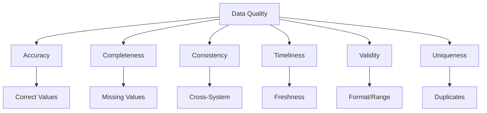
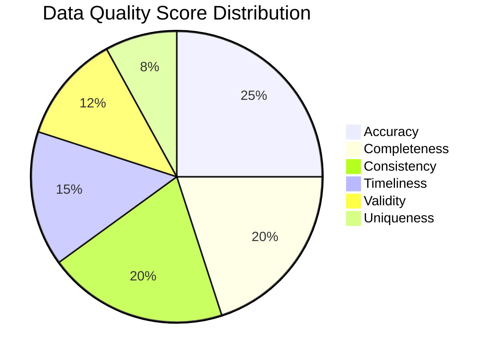
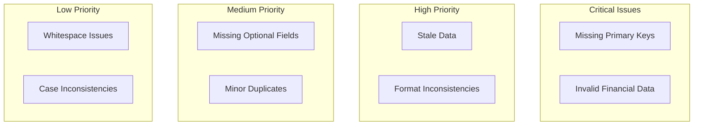
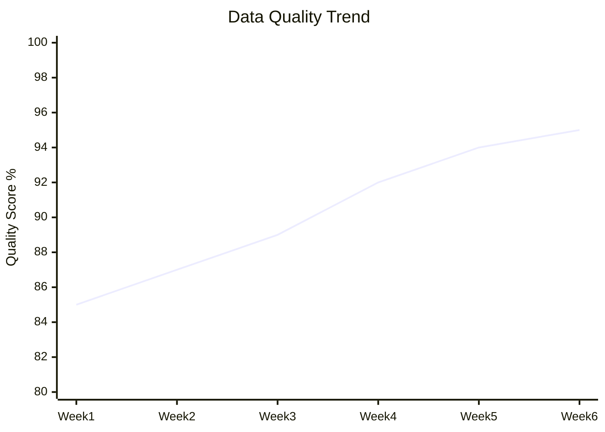

# Data Quality Report

<!-- Data quality assessment following DAMA-DMBOK framework -->

---

## Document Control

| Field              | Value                     |
| ------------------ | ------------------------- |
| **Report ID**      | DQR-[YYYY]-[NNN]          |
| **Version**        | [X.Y.Z]                   |
| **Date**           | [YYYY-MM-DD]              |
| **Author**         | [Name, Role]              |
| **Reviewer**       | [Name, Role]              |
| **Data Owner**     | [Name, Role]              |
| **Status**         | Draft / Review / Approved |
| **Classification** | Internal / Confidential   |

> [!NOTE]
> This report assesses data quality across six dimensions: accuracy, completeness, consistency, timeliness, validity, and uniqueness.

---

## Executive Summary

### Assessment Overview

| Metric               | Score | Target | Status   |
| -------------------- | ----- | ------ | -------- |
| Overall Data Quality | [X]%  | > 95%  | ✅/⚠️/❌ |
| Critical Issues      | [N]   | 0      | ✅/⚠️/❌ |
| High Priority Issues | [N]   | < 5    | ✅/⚠️/❌ |
| Data Assets Assessed | [N]   | -      | -        |

### Key Findings

1. **[Finding 1]:** [Brief description and impact]
2. **[Finding 2]:** [Brief description and impact]
3. **[Finding 3]:** [Brief description and impact]

### Recommendations

1. [Recommendation 1 with priority]
2. [Recommendation 2 with priority]
3. [Recommendation 3 with priority]

---

## Scope & Methodology

### Assessment Scope

| Data Asset | Type            | Records | Owner  | Criticality  |
| ---------- | --------------- | ------- | ------ | ------------ |
| [Asset 1]  | [Table/Dataset] | [N]     | [Name] | High/Med/Low |
| [Asset 2]  | [Table/Dataset] | [N]     | [Name] | High/Med/Low |
| [Asset 3]  | [Table/Dataset] | [N]     | [Name] | High/Med/Low |

### Quality Dimensions

### Assessment Methodology

1. **Automated Profiling:** [Tools used, e.g., Great Expectations, dbt tests]
2. **Statistical Analysis:** [Methods applied]
3. **Business Rule Validation:** [Rules checked]
4. **Sampling:** [Sample size and method]

---

## Data Quality Scores

### Overall Quality Score

$$\text{Data Quality Score} = \frac{\sum_{i=1}^{n} (w_i \times s_i)}{\sum_{i=1}^{n} w_i}$$

Where:

- $w_i$ = weight of dimension $i$
- $s_i$ = score of dimension $i$
- $n$ = number of dimensions

### Dimension Scores

| Dimension    | Weight   | Score | Weighted | Status   |
| ------------ | -------- | ----- | -------- | -------- |
| Accuracy     | 25%      | [X]%  | [X]%     | ✅/⚠️/❌ |
| Completeness | 20%      | [X]%  | [X]%     | ✅/⚠️/❌ |
| Consistency  | 20%      | [X]%  | [X]%     | ✅/⚠️/❌ |
| Timeliness   | 15%      | [X]%  | [X]%     | ✅/⚠️/❌ |
| Validity     | 12%      | [X]%  | [X]%     | ✅/⚠️/❌ |
| Uniqueness   | 8%       | [X]%  | [X]%     | ✅/⚠️/❌ |
| **Overall**  | **100%** | -     | **[X]%** | ✅/⚠️/❌ |

---

## Detailed Findings

### 1. Accuracy

**Definition:** Data correctly represents the real-world entity it describes.

**Score:** [X]%

| Check                     | Records Checked | Passed | Failed | Score |
| ------------------------- | --------------- | ------ | ------ | ----- |
| Reference data match      | [N]             | [N]    | [N]    | [X]%  |
| Calculated field accuracy | [N]             | [N]    | [N]    | [X]%  |
| Business rule compliance  | [N]             | [N]    | [N]    | [X]%  |

**Issues:**

| Issue     | Severity      | Records Affected | Root Cause |
| --------- | ------------- | ---------------- | ---------- |
| [Issue 1] | Critical/High | [N]              | [Cause]    |
| [Issue 2] | Medium        | [N]              | [Cause]    |

### 2. Completeness

**Definition:** All required data elements are present.

**Score:** [X]%

| Field     | Null Rate | Target | Status   |
| --------- | --------- | ------ | -------- |
| [Field 1] | [X]%      | < 1%   | ✅/⚠️/❌ |
| [Field 2] | [X]%      | < 5%   | ✅/⚠️/❌ |
| [Field 3] | [X]%      | < 10%  | ✅/⚠️/❌ |

**Completeness Formula:**

$$\text{Completeness} = \frac{\text{Non-Null Values}}{\text{Total Records}} \times 100$$

### 3. Consistency

**Definition:** Data values are consistent across systems and time.

**Score:** [X]%

| Check                       | Systems | Matches | Mismatches | Score |
| --------------------------- | ------- | ------- | ---------- | ----- |
| Cross-system reconciliation | [N]     | [N]     | [N]        | [X]%  |
| Temporal consistency        | [N]     | [N]     | [N]        | [X]%  |
| Format consistency          | [N]     | [N]     | [N]        | [X]%  |

### 4. Timeliness

**Definition:** Data is available when needed and reflects current state.

**Score:** [X]%

| Data Asset | Update Frequency | Last Update | Latency   | Status   |
| ---------- | ---------------- | ----------- | --------- | -------- |
| [Asset 1]  | Hourly           | [Time]      | [X] min   | ✅/⚠️/❌ |
| [Asset 2]  | Daily            | [Time]      | [X] hours | ✅/⚠️/❌ |
| [Asset 3]  | Real-time        | [Time]      | [X] sec   | ✅/⚠️/❌ |

### 5. Validity

**Definition:** Data conforms to defined formats, types, and ranges.

**Score:** [X]%

| Rule          | Records Checked | Violations | Score |
| ------------- | --------------- | ---------- | ----- |
| Email format  | [N]             | [N]        | [X]%  |
| Date range    | [N]             | [N]        | [X]%  |
| Numeric range | [N]             | [N]        | [X]%  |
| Enum values   | [N]             | [N]        | [X]%  |

### 6. Uniqueness

**Definition:** No unintended duplicate records exist.

**Score:** [X]%

| Entity     | Total Records | Unique | Duplicates | Score |
| ---------- | ------------- | ------ | ---------- | ----- |
| [Entity 1] | [N]           | [N]    | [N]        | [X]%  |
| [Entity 2] | [N]           | [N]    | [N]        | [X]%  |

**Duplicate Detection:**

$$\text{Uniqueness} = \frac{\text{Unique Records}}{\text{Total Records}} \times 100$$

---

## Issue Summary

### Issue Breakdown

### Issue Register

| ID     | Description   | Dimension   | Severity | Records | Owner  | Due Date |
| ------ | ------------- | ----------- | -------- | ------- | ------ | -------- |
| DQ-001 | [Description] | [Dimension] | Critical | [N]     | [Name] | [Date]   |
| DQ-002 | [Description] | [Dimension] | High     | [N]     | [Name] | [Date]   |
| DQ-003 | [Description] | [Dimension] | Medium   | [N]     | [Name] | [Date]   |

---

## Root Cause Analysis

### Common Causes

| Cause Category | Count | % of Issues | Examples   |
| -------------- | ----- | ----------- | ---------- |
| Source System  | [N]   | [X]%        | [Examples] |
| ETL Process    | [N]   | [X]%        | [Examples] |
| User Input     | [N]   | [X]%        | [Examples] |
| Integration    | [N]   | [X]%        | [Examples] |
| Unknown        | [N]   | [X]%        | [Examples] |

### 5 Whys Example

**Problem:** [Specific data quality issue]

1. **Why:** [Answer]
2. **Why:** [Answer]
3. **Why:** [Answer]
4. **Why:** [Answer]
5. **Why:** [Root cause]

---

## Remediation Plan

### Immediate Actions (This Week)

| Action     | Owner  | Priority | Due Date | Status |
| ---------- | ------ | -------- | -------- | ------ |
| [Action 1] | [Name] | P0       | [Date]   | ⬜     |
| [Action 2] | [Name] | P0       | [Date]   | ⬜     |

### Short-term Actions (This Month)

| Action     | Owner  | Priority | Due Date | Status |
| ---------- | ------ | -------- | -------- | ------ |
| [Action 1] | [Name] | P1       | [Date]   | ⬜     |
| [Action 2] | [Name] | P1       | [Date]   | ⬜     |

### Long-term Improvements (This Quarter)

| Action     | Owner  | Priority | Due Date | Status |
| ---------- | ------ | -------- | -------- | ------ |
| [Action 1] | [Name] | P2       | [Date]   | ⬜     |
| [Action 2] | [Name] | P2       | [Date]   | ⬜     |

---

## Monitoring & Governance

### Quality Rules

| Rule     | Description   | Threshold   | Alert     |
| -------- | ------------- | ----------- | --------- |
| [Rule 1] | [Description] | [Threshold] | [Channel] |
| [Rule 2] | [Description] | [Threshold] | [Channel] |

### Data Quality Dashboard

### Review Schedule

| Review Type     | Frequency | Owner            |
| --------------- | --------- | ---------------- |
| Quality Metrics | Daily     | Data Engineering |
| Quality Report  | Weekly    | Data Steward     |
| Quality Review  | Monthly   | Data Governance  |

---

## Appendices

### A. Data Profiling Results

[Detailed profiling statistics]

### B. Test Results

[Detailed test execution results]

### C. Sample Issues

[Examples of data quality issues found]

---

_Last updated: [Date]_

---

## See Also

- [ETL Specification](./etl_spec.md) — Data pipeline documentation
- [Data Lineage](./data_lineage.md) — Data flow documentation
- [Data Governance Framework](./data_governance_framework.md) — Governance policies
