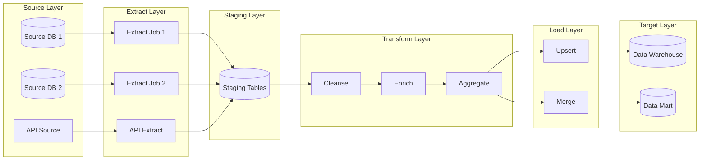
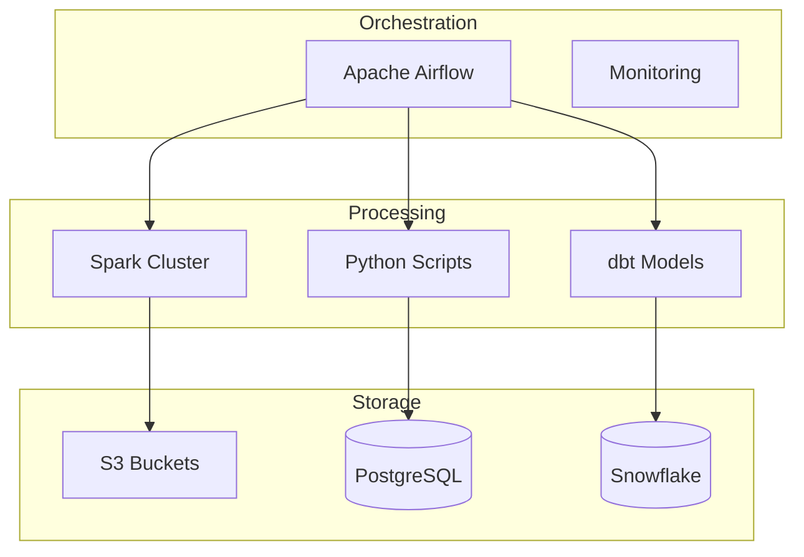
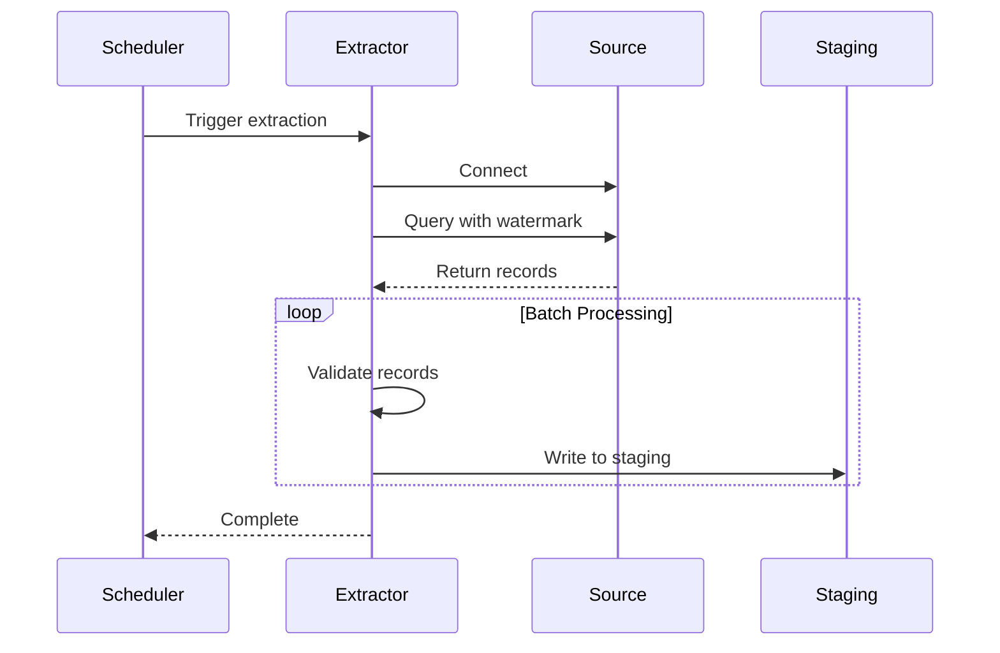
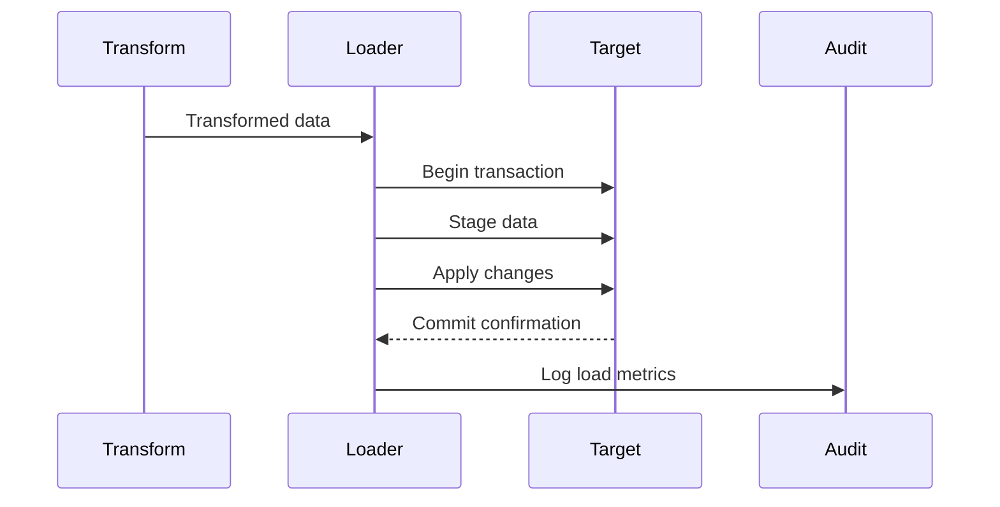
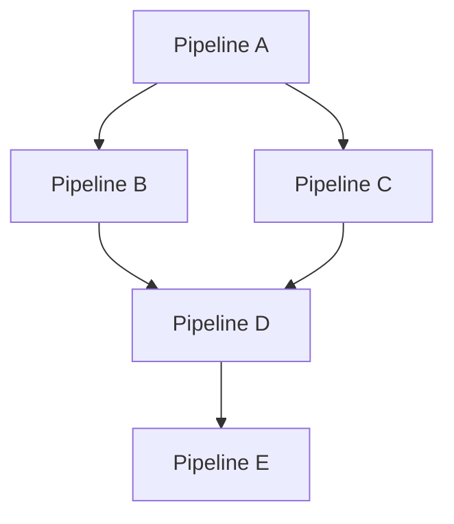

# ETL Specification

<!-- ETL pipeline design and implementation specification -->

---

## Document Control

| Field                | Value                                      |
| -------------------- | ------------------------------------------ |
| **Specification ID** | ETL-[YYYY]-[NNN]                           |
| **Version**          | [X.Y.Z]                                    |
| **Date**             | [YYYY-MM-DD]                               |
| **Author**           | [Name, Role]                               |
| **Reviewer**         | [Name, Role]                               |
| **Pipeline Owner**   | [Name, Role]                               |
| **Status**           | Draft / Review / Approved / Deprecated     |
| **Schedule**         | [Frequency: Hourly/Daily/Weekly/Real-time] |

> [!NOTE]
> This specification defines the ETL pipeline including source systems, transformations, and target destinations.

---

## Executive Summary

### Pipeline Overview

| Attribute          | Value                         |
| ------------------ | ----------------------------- |
| **Pipeline Name**  | [Name]                        |
| **Purpose**        | [Brief description]           |
| **Source Systems** | [List]                        |
| **Target System**  | [System name]                 |
| **Data Volume**    | [N] records / [N] GB per run  |
| **SLA**            | [Completion time requirement] |
| **Criticality**    | High / Medium / Low           |

### Key Metrics

| Metric            | Target    | Current |
| ----------------- | --------- | ------- |
| Success Rate      | > 99%     | [X]%    |
| Avg Duration      | < [N] min | [N] min |
| Records Processed | [N]/run   | [N]/run |
| Error Rate        | < 0.1%    | [X]%    |

---

## Architecture

### Pipeline Flow



### Component Diagram



---

## Source Systems

### Source: [System Name]

| Attribute             | Value                          |
| --------------------- | ------------------------------ |
| **System Type**       | Database / API / File / Stream |
| **Connection Method** | JDBC / ODBC / REST / SFTP      |
| **Authentication**    | [Method]                       |
| **Network**           | VPN / Direct / Public          |

#### Source Entities

| Entity    | Records | Incremental Field | Last Updated |
| --------- | ------- | ----------------- | ------------ |
| [Table 1] | [N]     | [Field]           | [Timestamp]  |
| [Table 2] | [N]     | [Field]           | [Timestamp]  |

#### Extraction Logic

```sql
-- Extraction query for [Table]
SELECT
    column_1,
    column_2,
    column_3,
    updated_at
FROM source_table
WHERE updated_at > '{{ last_extraction_time }}'
  AND status = 'ACTIVE'
```

---

## Extraction Phase

### Extraction Strategy

| Aspect              | Configuration                            |
| ------------------- | ---------------------------------------- |
| **Method**          | Full / Incremental / Change Data Capture |
| **Watermark Field** | [Field name]                             |
| **Batch Size**      | [N] records                              |
| **Parallelism**     | [N] threads                              |
| **Timeout**         | [N] seconds                              |

### Extraction Sequence



### Error Handling

| Error Type           | Action     | Retry | Alert |
| -------------------- | ---------- | ----- | ----- |
| Connection timeout   | Retry      | 3x    | Yes   |
| Data validation fail | Log & skip | No    | Yes   |
| Schema mismatch      | Abort      | No    | Yes   |

---

## Transformation Phase

### Transformation Logic

#### Step 1: Data Cleansing

| Rule     | Description   | Implementation    |
| -------- | ------------- | ----------------- |
| [Rule 1] | [Description] | [SQL/Python code] |
| [Rule 2] | [Description] | [SQL/Python code] |

```python
# Example transformation
def cleanse_data(df):
    """Cleanse raw data"""
    # Remove nulls
    df = df.dropna(subset=['required_field'])

    # Standardize formats
    df['email'] = df['email'].str.lower().str.strip()

    # Validate ranges
    df = df[df['amount'] >= 0]

    return df
```

#### Step 2: Data Enrichment

| Source           | Target Field | Logic           |
| ---------------- | ------------ | --------------- |
| [Lookup table]   | [Field]      | [Join logic]    |
| [Reference data] | [Field]      | [Mapping logic] |

#### Step 3: Business Rules

```sql
-- Business transformation
SELECT
    customer_id,
    order_date,
    amount,
    CASE
        WHEN amount > 1000 THEN 'High Value'
        WHEN amount > 100 THEN 'Medium Value'
        ELSE 'Low Value'
    END as customer_segment,
    amount * 0.1 as commission
FROM cleansed_orders
```

### Data Quality Checks

| Check                 | Threshold | Action on Fail |
| --------------------- | --------- | -------------- |
| Row count             | ± 10%     | Alert          |
| Null rate             | < 5%      | Fail           |
| Duplicate keys        | 0         | Fail           |
| Referential integrity | 100%      | Fail           |

---

## Load Phase

### Loading Strategy

| Aspect               | Configuration           |
| -------------------- | ----------------------- |
| **Method**           | INSERT / UPSERT / MERGE |
| **Batch Size**       | [N] records             |
| **Parallelism**      | [N] threads             |
| **Transaction Size** | [N] records             |

### Load Sequence



### Target Schema

| Field     | Type   | Source   | Transformation |
| --------- | ------ | -------- | -------------- |
| [Field 1] | [Type] | [Source] | [Transform]    |
| [Field 2] | [Type] | [Source] | [Transform]    |
| [Field 3] | [Type] | [Source] | [Transform]    |

---

## Scheduling & Orchestration

### Schedule

| Environment | Frequency | Start Time | SLA       |
| ----------- | --------- | ---------- | --------- |
| Development | On-demand | Manual     | N/A       |
| Staging     | Daily     | 02:00 UTC  | 04:00 UTC |
| Production  | Hourly    | :00        | :45       |

### Dependencies



| Pipeline     | Depends On   | Trigger  |
| ------------ | ------------ | -------- |
| [Pipeline 1] | -            | Schedule |
| [Pipeline 2] | [Pipeline 1] | Success  |
| [Pipeline 3] | [Pipeline 1] | Success  |

---

## Monitoring & Alerting

### Metrics

| Metric            | Target   | Warning | Critical |
| ----------------- | -------- | ------- | -------- |
| Duration          | < 30 min | 45 min  | 60 min   |
| Success Rate      | > 99%    | 95%     | 90%      |
| Records processed | Expected | -10%    | -25%     |
| Error rate        | < 0.1%   | 1%      | 5%       |

### Alerts

| Condition         | Severity | Channel   | Response  |
| ----------------- | -------- | --------- | --------- |
| Pipeline failed   | Critical | PagerDuty | Immediate |
| Duration > SLA    | Warning  | Slack     | Review    |
| Data quality fail | High     | Email     | 1 hour    |

---

## Error Handling & Recovery

### Failure Scenarios

| Scenario             | Detection          | Action         | Recovery            |
| -------------------- | ------------------ | -------------- | ------------------- |
| Source unavailable   | Connection timeout | Retry 3x       | Alert after retries |
| Data validation fail | Quality check      | Log & continue | Manual review       |
| Target write fail    | Transaction error  | Rollback       | Retry with backoff  |
| Partial load         | Row count mismatch | Rollback       | Re-run from start   |

### Recovery Procedures

1. **Identify failure point:** Check logs and monitoring
2. **Assess impact:** Determine records affected
3. **Choose recovery method:**
   - Re-run from start
   - Resume from checkpoint
   - Manual intervention
4. **Validate recovery:** Run data quality checks
5. **Document incident:** Update runbook

---

## Performance Optimization

### Current Performance

| Phase     | Duration    | Records/Sec | Bottleneck  |
| --------- | ----------- | ----------- | ----------- |
| Extract   | [N] min     | [N]         | [Component] |
| Transform | [N] min     | [N]         | [Component] |
| Load      | [N] min     | [N]         | [Component] |
| **Total** | **[N] min** | **[N]**     | -           |

### Optimization Strategies

| Strategy     | Impact | Effort | Priority |
| ------------ | ------ | ------ | -------- |
| [Strategy 1] | High   | Medium | P1       |
| [Strategy 2] | Medium | Low    | P2       |

---

## Security

### Data Protection

| Aspect                | Implementation     |
| --------------------- | ------------------ |
| Encryption in transit | TLS 1.3            |
| Encryption at rest    | AES-256            |
| PII handling          | Masked in non-prod |
| Access control        | Role-based         |

### Audit Trail

| Event          | Logged | Retention |
| -------------- | ------ | --------- |
| Pipeline start | Yes    | 90 days   |
| Pipeline end   | Yes    | 90 days   |
| Record counts  | Yes    | 90 days   |
| Errors         | Yes    | 1 year    |

---

## Appendices

### A. Full Source Queries

[Complete extraction queries]

### B. Transformation Code

[Complete transformation scripts]

### C. Test Cases

[Unit and integration tests]

---

_Last updated: [Date]_

---

## See Also

- [Data Quality Report](./data_quality_report.md) — Quality assessment
- [Data Lineage](./data_lineage.md) — Data flow documentation
- [Data Warehouse Schema](./warehouse_schema.md) — Target schema details
