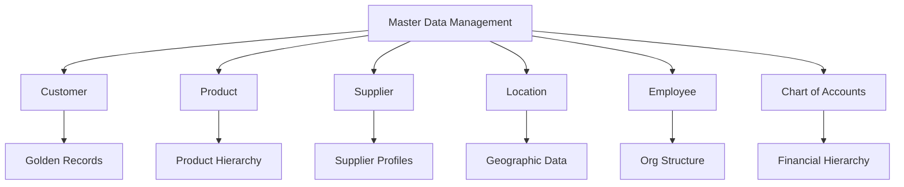
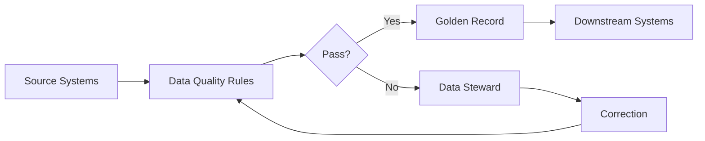
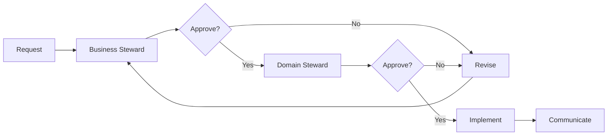
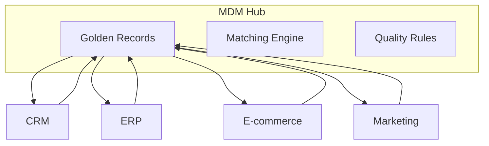
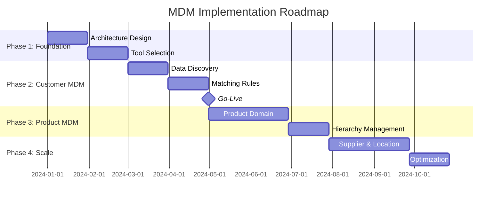

# Master Data Management (MDM) Policy

<!-- Framework for managing critical business data entities -->

---

## Document Control

| Field              | Value                         |
| ------------------ | ----------------------------- |
| **Policy Name**    | Master Data Management Policy |
| **Version**        | [X.X]                         |
| **Effective Date** | [DD-MMM-YYYY]                 |
| **Owner**          | Chief Data Officer            |
| **Review Cycle**   | Annual                        |

---

## Master Data Domains

### Domain Inventory

| Domain   | Systems              | Records | Golden Records | Quality Score |
| -------- | -------------------- | ------- | -------------- | ------------- |
| Customer | CRM, ERP, Marketing  | [X]M    | [X]%           | [X]%          |
| Product  | ERP, PIM, E-commerce | [X]K    | [X]%           | [X]%          |
| Supplier | ERP, SRM             | [X]K    | [X]%           | [X]%          |
| Location | ERP, GIS             | [X]     | [X]%           | [X]%          |

---

## Golden Record Creation

### Record Matching

$$Match\ Score = \sum_{i=1}^{n} w_i \times s_i$$

Where:

- $w_i$ = field weight
- $s_i$ = similarity score (0-1)
- Match threshold: > [0.XX]

### Matching Rules

| Attribute | Weight | Matching Logic          |
| --------- | ------ | ----------------------- |
| Name      | [X]%   | Fuzzy match + Phonetic  |
| Address   | [X]%   | Standardized comparison |
| Email     | [X]%   | Exact match             |
| Phone     | [X]%   | Normalized comparison   |
| ID Number | [X]%   | Exact match             |

### Survivorship Rules

| Attribute | Source Priority       | Rule          |
| --------- | --------------------- | ------------- |
| Name      | CRM > ERP > Marketing | Most frequent |
| Address   | ERP > CRM             | Most recent   |
| Phone     | CRM > ERP             | Most recent   |
| Email     | Marketing > CRM       | Most recent   |

---

## Data Quality

### Quality Dimensions

$$Data\ Quality\ Score = \frac{Completeness + Accuracy + Consistency + Timeliness + Validity}{5}$$

| Dimension    | Weight   | Threshold | Current  |
| ------------ | -------- | --------- | -------- |
| Completeness | 20%      | >95%      | [X]%     |
| Accuracy     | 25%      | >98%      | [X]%     |
| Consistency  | 20%      | >95%      | [X]%     |
| Timeliness   | 15%      | <24hrs    | [X]hrs   |
| Validity     | 20%      | >99%      | [X]%     |
| **Overall**  | **100%** | **>95%**  | **[X]%** |

### Quality Monitoring

---

## Data Stewardship

### Steward Roles

| Role                  | Responsibility     | Domain   |
| --------------------- | ------------------ | -------- |
| **Domain Steward**    | Policy, standards  | [Domain] |
| **Business Steward**  | Definitions, rules | [Domain] |
| **Technical Steward** | Implementation     | [Domain] |

### Stewardship RACI

| Activity          | Domain Steward | Business Steward | Technical Steward |
| ----------------- | -------------- | ---------------- | ----------------- |
| Define standards  | A              | R                | C                 |
| Approve changes   | A              | R                | C                 |
| Resolve conflicts | A              | R                | I                 |
| Monitor quality   | C              | R                | A                 |
| Implement rules   | I              | C                | A                 |

---

## Data Governance

### Approval Workflow

### Change Management

| Change Type       | Approval Required       | Timeline |
| ----------------- | ----------------------- | -------- |
| Definition update | Business Steward        | 5 days   |
| New attribute     | Domain Steward          | 10 days  |
| New domain        | Data Governance Council | 30 days  |

---

## Integration Architecture

### Hub Architecture

### Data Flow

| Direction    | Frequency | Volume         | SLA   |
| ------------ | --------- | -------------- | ----- |
| Source → MDM | Real-time | [X] records/hr | <5min |
| MDM → Source | Hourly    | [X] records    | <1hr  |
| Batch sync   | Daily     | [X] records    | <4hrs |

---

## Metrics & KPIs

### Operational Metrics

| Metric                | Target | Current | Status |
| --------------------- | ------ | ------- | ------ |
| Golden Record Rate    | >95%   | [X]%    | [ ]    |
| Match Accuracy        | >99%   | [X]%    | [ ]    |
| Data Quality Score    | >95%   | [X]%    | [ ]    |
| Steward Response Time | <24hrs | [X]hrs  | [ ]    |

### Business Value

| Metric                     | Before MDM | After MDM | Improvement |
| -------------------------- | ---------- | --------- | ----------- |
| Duplicate customer records | [X]%       | [X]%      | [X]%        |
| Order processing time      | [X] min    | [X] min   | [X]%        |
| Data reconciliation time   | [X] hrs    | [X] hrs   | [X]%        |
| Customer satisfaction      | [X]        | [X]       | +[X]        |

---

## Implementation Roadmap

---

**Approved:** ********\_******** Date: ****\_****
