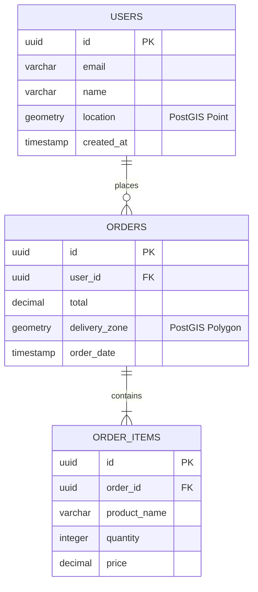

# SQL Database Schema Definitions (PostGIS)

## Overview

SQL as a **vector format** for defining database structures, relationships, and geospatial data. This combines:

- **Phase 1**: SQL DDL in markdown code blocks (source of truth)
- **Mermaid ER diagrams**: Visual representation of tables and relationships
- **PostGIS extensions**: Geospatial data types and operations

## Why SQL as Vector Format?

Unlike raster images, SQL definitions are:

- **Text-based**: Version controllable, diff-able
- **Executable**: Can be run against real databases
- **Human-readable**: Self-documenting structure
- **Machine-parseable**: Can generate diagrams, validation, migrations

## Structure

Each schema template contains:

1. **Mermaid ER diagram** - Visual entity-relationship view
2. **SQL DDL** - CREATE TABLE, INDEX, CONSTRAINT statements
3. **PostGIS extensions** - Geometry/geography columns, spatial indexes
4. **Sample data** - INSERT statements for testing

## Dialect

**PostgreSQL with PostGIS**

- Full SQL:2011 compliance
- PostGIS 3.x for geospatial
- JSONB for document storage
- Advanced indexing (GIN, GiST, SP-GiST)

## Templates

| Complexity                         | Tables | Purpose                             |
| ---------------------------------- | ------ | ----------------------------------- |
| [simple.md](simple.md)             | 2-4    | Basic schema with CRUD              |
| [intermediate.md](intermediate.md) | 4-8    | Multi-entity with relationships     |
| [advanced.md](advanced.md)         | 8-15   | Complex warehouse with partitioning |

## Example



**SQL DDL:**

```sql
-- Enable PostGIS
CREATE EXTENSION IF NOT EXISTS postgis;

-- Users table with geospatial location
CREATE TABLE users (
    id UUID PRIMARY KEY DEFAULT gen_random_uuid(),
    email VARCHAR(255) UNIQUE NOT NULL,
    name VARCHAR(100) NOT NULL,
    location GEOGRAPHY(POINT, 4326), -- WGS 84 coordinate system
    created_at TIMESTAMP WITH TIME ZONE DEFAULT NOW(),

    CONSTRAINT chk_email_format CHECK (email ~* '^[A-Za-z0-9._%+-]+@[A-Za-z0-9.-]+\.[A-Za-z]{2,}$')
);

-- Spatial index for location queries
CREATE INDEX idx_users_location ON users USING GIST(location);

-- Orders with delivery zone
CREATE TABLE orders (
    id UUID PRIMARY KEY DEFAULT gen_random_uuid(),
    user_id UUID NOT NULL REFERENCES users(id) ON DELETE CASCADE,
    total DECIMAL(10,2) NOT NULL DEFAULT 0.00,
    delivery_zone GEOGRAPHY(POLYGON, 4326), -- Delivery boundary
    order_date TIMESTAMP WITH TIME ZONE DEFAULT NOW()
);

CREATE INDEX idx_orders_user ON orders(user_id);
CREATE INDEX idx_orders_delivery_zone ON orders USING GIST(delivery_zone);

-- Order items
CREATE TABLE order_items (
    id UUID PRIMARY KEY DEFAULT gen_random_uuid(),
    order_id UUID NOT NULL REFERENCES orders(id) ON DELETE CASCADE,
    product_name VARCHAR(255) NOT NULL,
    quantity INTEGER NOT NULL CHECK (quantity > 0),
    price DECIMAL(10,2) NOT NULL
);

-- Sample geospatial query: Find users within 5km of a point
-- SELECT * FROM users
-- WHERE ST_DWithin(
--   location,
--   ST_SetSRID(ST_MakePoint(-122.4194, 37.7749), 4326)::geography,
--   5000
-- );
```

## File Organization

```
sql/
├── SKILL.md                    # This file
├── index.md                    # Selection guide
├── style-guide.md              # SQL naming conventions
├── postgis-reference.md        # Geospatial functions
├── simple/
│   ├── user-profile.sql.md     # User management
│   └── product-catalog.sql.md  # Basic inventory
├── intermediate/
│   ├── e-commerce.sql.md       # Orders, payments, inventory
│   └── location-tracking.sql.md # Fleet/asset tracking
└── advanced/
    ├── data-warehouse.sql.md   # Star schema, partitioning
    └── multi-tenant.sql.md    # Schema-per-tenant
```

## Related

- [Mermaid ER Diagrams](../../../../visuals/mermaid/types/er/index.md) - Visual diagram syntax
- [System Design Database Schema](../../system_design/database_schema.md) - Architecture patterns
- [Data Warehouse Schema](../warehouse_schema.md) - Analytics schemas
