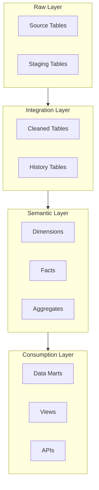
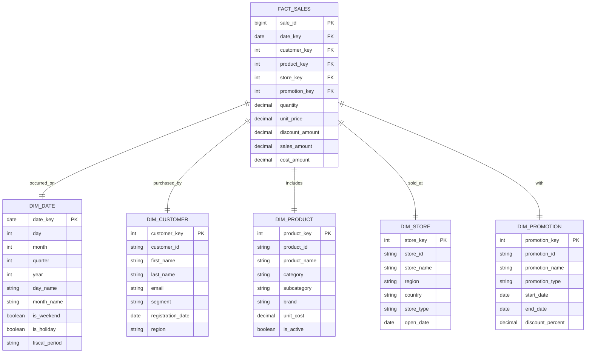
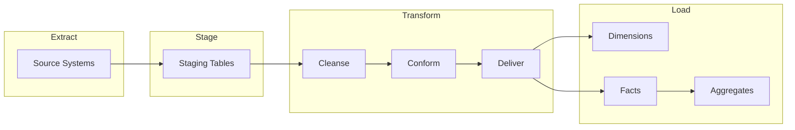

# Data Warehouse Schema

<!-- Dimensional model and schema documentation -->

---

## Document Control

| Field                 | Value                        |
| --------------------- | ---------------------------- |
| **Schema ID**         | DW-[YYYY]-[NNN]              |
| **Version**           | [X.Y.Z]                      |
| **Date**              | [YYYY-MM-DD]                 |
| **Author**            | [Name, Role]                 |
| **Reviewer**          | [Name, Role]                 |
| **Modeling Approach** | Kimball / Data Vault / Inmon |
| **Status**            | Draft / Review / Approved    |

> [!NOTE]
> This schema follows [Kimball/Data Vault/Inmon] methodology for dimensional modeling.

---

## Executive Summary

### Warehouse Overview

| Attribute      | Value                                        |
| -------------- | -------------------------------------------- |
| **Platform**   | Snowflake / BigQuery / Redshift / Databricks |
| **Size**       | [N] TB                                       |
| **Tables**     | [N]                                          |
| **Daily Load** | [N] GB                                       |
| **Users**      | [N]                                          |

### Schema Architecture



---

## Dimensional Model

### Star Schema Overview



---

## Fact Tables

### Fact: [Fact Name]

| Attribute              | Value                      |
| ---------------------- | -------------------------- |
| **Grain**              | [One row per...]           |
| **Update Frequency**   | Daily / Hourly / Real-time |
| **Retention**          | [N] years                  |
| **Partition Strategy** | [Date/Region/etc]          |

#### Schema

| Column          | Type    | Source      | Description   |
| --------------- | ------- | ----------- | ------------- |
| [Column 1]\_key | INT     | Generated   | Surrogate key |
| [Column 2]\_key | INT     | [Dimension] | Foreign key   |
| [Measure 1]     | DECIMAL | [Source]    | [Description] |
| [Measure 2]     | INT     | [Source]    | [Description] |

#### Measures

| Measure         | Formula               | Aggregation | Format   |
| --------------- | --------------------- | ----------- | -------- |
| Sales Amount    | quantity × unit_price | SUM         | Currency |
| Discount Amount | quantity × discount   | SUM         | Currency |
| Cost Amount     | quantity × unit_cost  | SUM         | Currency |
| Gross Profit    | sales - cost          | SUM         | Currency |

**Gross Profit Calculation:**

$$\text{Gross Profit} = \sum_{i=1}^{n} (\text{Sales Amount}_i - \text{Cost Amount}_i)$$

#### Degenerate Dimensions

| Column   | Description   |
| -------- | ------------- |
| [Column] | [Description] |

---

## Dimension Tables

### Dimension: [Dimension Name]

| Attribute            | Value                    |
| -------------------- | ------------------------ |
| **Type**             | Type 1 / Type 2 / Type 3 |
| **SCD Strategy**     | [Strategy]               |
| **Update Frequency** | [Frequency]              |
| **Record Count**     | [N]                      |

#### Schema

| Column        | Type    | Source    | Description        |
| ------------- | ------- | --------- | ------------------ |
| [name]\_key   | INT     | Generated | Surrogate key (PK) |
| [name]\_id    | VARCHAR | Source    | Natural key        |
| [attribute 1] | [Type]  | Source    | [Description]      |
| [attribute 2] | [Type]  | Source    | [Description]      |

#### Slowly Changing Dimensions (Type 2)

| Column          | Purpose                         |
| --------------- | ------------------------------- |
| effective_date  | When this version became active |
| expiration_date | When this version expired       |
| is_current      | Current version flag            |
| version_number  | Incremental version             |

#### Hierarchies

```mermaid
flowchart TB
    accTitle: Dimension Hierarchy
    accDescr: Drill-down paths for analysis

    subgraph Product["Product Hierarchy"]
        P1[Category]
        P2[Subcategory]
        P3[Brand]
        P4[Product]
    end

    subgraph Geography["Geography Hierarchy"]
        G1[Region]
        G2[Country]
        G3[State]
        G4[City]
        G5[Store]
    end

    subgraph Time["Time Hierarchy"]
        T1[Year]
        T2[Quarter]
        T3[Month]
        T4[Week]
        T5[Day]
    end

    P1 --> P2 --> P3 --> P4
    G1 --> G2 --> G3 --> G4 --> G5
    T1 --> T2 --> T3 --> T4 --> T5
```



---

## Aggregate Tables

### Aggregate: [Aggregate Name]

**Purpose:** [Why this aggregate exists]

| Attribute            | Value               |
| -------------------- | ------------------- |
| **Base Fact**        | [Source fact]       |
| **Grain**            | [Aggregation level] |
| **Refresh Schedule** | [Frequency]         |

#### Schema

| Column           | Type    | Description         |
| ---------------- | ------- | ------------------- |
| [Dimension keys] | INT     | Foreign keys        |
| [Measures]       | DECIMAL | Aggregated measures |
| record_count     | INT     | Source record count |

#### Aggregation Logic

```sql
CREATE TABLE agg_daily_sales AS
SELECT
    date_key,
    product_key,
    region_key,
    SUM(sales_amount) as total_sales,
    SUM(quantity) as total_quantity,
    COUNT(*) as transaction_count,
    AVG(unit_price) as avg_price
FROM fact_sales
GROUP BY date_key, product_key, region_key
```

---

## Data Flow

### ETL Process



### Load Sequence

| Step | Operation        | Dependencies |
| ---- | ---------------- | ------------ |
| 1    | Load dimensions  | None         |
| 2    | Lookup keys      | Step 1       |
| 3    | Load facts       | Step 2       |
| 4    | Build aggregates | Step 3       |
| 5    | Update indexes   | Step 4       |

---

## Physical Design

### Partitioning Strategy

| Table          | Partition Key | Strategy        | Retention |
| -------------- | ------------- | --------------- | --------- |
| fact_sales     | date_key      | Range (monthly) | 3 years   |
| fact_inventory | date_key      | Range (daily)   | 1 year    |
| dim_customer   | region        | List            | Permanent |

### Indexing

| Table        | Index Type | Columns     | Purpose           |
| ------------ | ---------- | ----------- | ----------------- |
| fact_sales   | Clustered  | date_key    | Partition pruning |
| fact_sales   | Bitmap     | product_key | Join optimization |
| dim_customer | B-tree     | customer_id | Lookup            |

### Compression

| Table        | Column | Compression | Ratio |
| ------------ | ------ | ----------- | ----- |
| fact_sales   | All    | ZSTD        | 5:1   |
| dim_customer | All    | LZ4         | 2:1   |

---

## Data Quality

### Quality Rules

| Rule                  | Table      | Severity | Check                  |
| --------------------- | ---------- | -------- | ---------------------- |
| Referential integrity | fact_sales | Critical | FK exists in dimension |
| Grain validation      | fact_sales | Critical | No duplicates          |
| Measure validation    | fact_sales | High     | No negative amounts    |

### Data Validation

```sql
-- Referential integrity check
SELECT COUNT(*) as orphan_count
FROM fact_sales f
LEFT JOIN dim_customer d ON f.customer_key = d.customer_key
WHERE d.customer_key IS NULL

-- Grain check
SELECT date_key, customer_key, product_key, COUNT(*) as cnt
FROM fact_sales
GROUP BY date_key, customer_key, product_key
HAVING COUNT(*) > 1
```

---

## Security

### Access Control

| Role      | Tables     | Permissions    |
| --------- | ---------- | -------------- |
| Analyst   | Views only | SELECT         |
| Developer | All        | SELECT, INSERT |
| Admin     | All        | All            |

### Column-Level Security

| Column | Classification | Masking        |
| ------ | -------------- | -------------- |
| email  | PII            | Partial mask   |
| ssn    | Sensitive      | Full mask      |
| salary | Confidential   | Aggregate only |

---

## Performance

### Query Optimization

| Technique         | Application      | Impact      |
| ----------------- | ---------------- | ----------- |
| Partition pruning | Date filters     | 10x faster  |
| Clustering keys   | Common joins     | 5x faster   |
| Result caching    | Repeated queries | 100x faster |

### Usage Statistics

| Table        | Queries/Day | Avg Duration | Cache Hit |
| ------------ | ----------- | ------------ | --------- |
| fact_sales   | [N]         | [N] ms       | [X]%      |
| dim_customer | [N]         | [N] ms       | [X]%      |

---

## Appendices

### A. Complete DDL

[Full CREATE TABLE statements]

### B. Sample Queries

[Common analytical queries]

### C. Change History

| Date   | Change        | Author |
| ------ | ------------- | ------ |
| [Date] | [Description] | [Name] |

---

_Last updated: [Date]_

---

## See Also

- [ETL Specification](./etl_spec.md) — Pipeline documentation
- [Data Lineage](./data_lineage.md) — Data flow tracking
- [Data Quality Report](./data_quality_report.md) — Quality metrics
