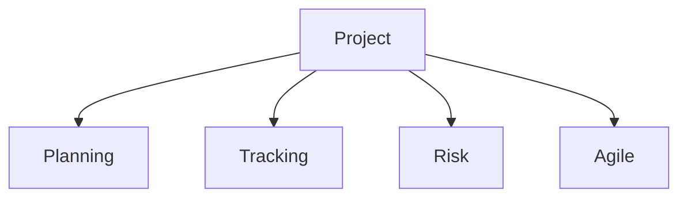

# Project

Project management, planning, and tracking templates.

## Templates

| Template                                 | Description      |
| ---------------------------------------- | ---------------- |
| [project_charter.md](project_charter.md) | Project charters |
| [status_report.md](status_report.md)     | Status reports   |
| [risk_assessment.md](risk_assessment.md) | Risk assessments |
| [sprint_planning.md](sprint_planning.md) | Sprint planning  |
| [retrospective.md](retrospective.md)     | Retrospectives   |

## Structure

See [Parent](../SKILL.md) for all categories.
