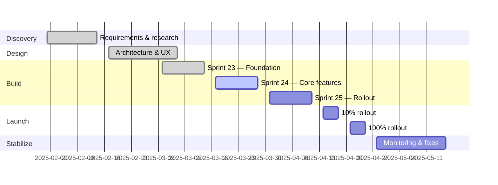

# Project Charter

> [!NOTE]
> The project charter is the founding document that authorizes the project to exist. It defines what success looks like, who is responsible, and what is in and out of scope. Once approved, it is the reference point for all scope discussions. Changes to the charter require sponsor approval.

**Project Name:** <!-- Full project title -->  
**Project Code:** <!-- Internal ID / ticket -->  
**Date:** <!-- YYYY-MM-DD -->  
**Version:** <!-- 1.0 -->  
**Status:** <!-- Draft | Approved | Active | Closed -->

**Example:**

**Project Name:** Checkout v2 — Saved Payment Methods  
**Project Code:** EP-018  
**Date:** 2025-02-01  
**Version:** 1.0  
**Status:** Approved

---

## 🎯 Executive Summary

> _2–3 sentences: what this project is, why it exists, and what success looks like._

[Write the executive summary here.]

**Example:** The Checkout v2 project redesigns the payment step of the checkout flow to support saved payment methods, reducing cart abandonment at the payment step from 23% to under 15%. The project delivers a Stripe-integrated saved card experience for returning customers, an admin view of customer payment methods, and a redesigned order confirmation email. Success is measured by a reduction in payment-step abandonment rate and an increase in repeat purchase rate within 30 days of launch.

---

## 📌 Problem Statement

> [!IMPORTANT]
> Be specific and measurable. Vague problem statements lead to vague solutions. Quantify the pain wherever possible.

**Current State:** <!-- What is happening today? -->  
**Desired State:** <!-- What should happen after this project? -->  
**Gap:** <!-- What is the delta we need to close? -->

**Example:**

**Current State:** Returning customers must re-enter full card details on every purchase. The payment step has a 23% abandonment rate (Analytics, Q1 2025), costing an estimated $180K/month in lost revenue. Competitors (Shopify, Amazon) offer one-click checkout.

**Desired State:** Returning customers can complete checkout using a saved payment method with only a CVV entry. Payment-step abandonment drops to < 15%.

**Gap:** No saved payment method infrastructure exists. Requires Stripe Vault integration, UI changes to checkout flow, and admin tooling.

---

## 🏆 Objectives & Success Criteria

| Objective                            | Success Metric                    | Target                | Measurement Method                |
| ------------------------------------ | --------------------------------- | --------------------- | --------------------------------- |
| <!-- e.g. Reduce onboarding time --> | <!-- e.g. Time-to-first-value --> | <!-- e.g. < 5 min --> | <!-- e.g. Analytics dashboard --> |
|                                      |                                   |                       |                                   |

**Example:**

| Objective                            | Success Metric                          | Target     | Measurement Method     |
| ------------------------------------ | --------------------------------------- | ---------- | ---------------------- |
| Reduce payment-step cart abandonment | Payment-step abandonment rate           | < 15%      | Mixpanel funnel report |
| Increase repeat purchase rate        | % customers purchasing again in 30 days | +5 pp      | Analytics dashboard    |
| Launch saved payment methods         | Feature available to 100% of users      | By 2025-Q2 | Feature flag rollout   |
| Maintain PCI DSS SAQ-A compliance    | Security audit pass                     | Pass       | Annual security audit  |

---

## 🔭 Scope

### In Scope

- Stripe Vault integration for saving payment methods
- Checkout flow UI: saved card selection, CVV-only entry for returning customers
- Expired card detection and prompt to add new card
- Admin portal: view customer saved payment methods
- Redesigned order confirmation email template
- Feature flag rollout (10% → 100% over 2 sprints)

### Out of Scope

- One-click checkout (deferred to EP-022, Q3 2025)
- Apple Pay / Google Pay integration (separate project)
- Subscription / recurring billing (separate project)
- Mobile app changes (web only for this project)

### Assumptions

- Stripe Vault API access will be provisioned by DevOps before Sprint 24 starts
- Legal has approved the updated privacy policy covering saved payment data
- PCI DSS SAQ-A compliance is maintained with Stripe Vault (no card data touches our servers)

### Constraints

- Must not increase checkout page load time by more than 100ms (p95)
- Must maintain PCI DSS SAQ-A compliance — no card data stored on our infrastructure
- Budget cap: $85,000 total (engineering + infrastructure)
- Must launch before Q2 end (2025-06-30) to capture summer shopping season

> [!WARNING]
> Scope creep is the #1 project killer. Any request to add features not listed in "In Scope" must go through the change control process and requires sponsor approval. Document all scope change requests, even rejected ones.

---

## 👥 Stakeholders

| Name          | Role          | Responsibility                            | Engagement Level  |
| ------------- | ------------- | ----------------------------------------- | ----------------- |
| David Park    | Sponsor       | Final approval, funding, escalation       | Inform monthly    |
| Priya Nair    | Product Owner | Requirements, prioritization, sign-off    | Consult weekly    |
| Alice Chen    | Tech Lead     | Architecture decisions, technical risk    | Collaborate daily |
| Jordan Lee    | Scrum Master  | Process, facilitation, impediment removal | Collaborate daily |
| Marcus Webb   | Security Lead | Security review, PCI DSS compliance       | Consult per PR    |
| <!-- Name --> | <!-- Role --> | <!-- Responsibility -->                   | <!-- Level -->    |

> [!TIP]
> "Engagement Level" matters. Stakeholders who should be consulted but are only informed will feel blindsided. Stakeholders who should be informed but are consulted on every decision will slow you down. Get this right at the start.

---

## 📅 High-Level Timeline

| Phase     | Description             | Start      | End        | Milestone                        |
| --------- | ----------------------- | ---------- | ---------- | -------------------------------- |
| Discovery | Requirements & research | 2025-02-01 | 2025-02-14 | Requirements doc signed off      |
| Design    | Architecture & UX       | 2025-02-17 | 2025-03-07 | Design approved by PO + Security |
| Build     | Development & testing   | 2025-03-03 | 2025-04-11 | Feature complete, QA signed off  |
| Launch    | Deployment & rollout    | 2025-04-14 | 2025-04-25 | 100% rollout, no P1 bugs         |
| Stabilize | Monitoring & fixes      | 2025-04-28 | 2025-05-16 | Project closed                   |

---

## 💰 Budget

| Category          | Estimated Cost | Approved Budget | Notes                               |
| ----------------- | -------------- | --------------- | ----------------------------------- |
| Engineering       | $60,000        | $62,000         | 3 devs × 6 weeks + QA               |
| Design            | $8,000         | $8,000          | Sara at 50% for 4 weeks             |
| Infrastructure    | $2,400         | $3,000          | Stripe Vault fees (est. 2K txns/mo) |
| Third-party tools | $1,200         | $1,500          | LaunchDarkly feature flags          |
| Contingency (10%) | $7,160         | $10,500         | Buffer for scope changes            |
| **Total**         | **$78,760**    | **$85,000**     |                                     |

---

## ⚠️ Top Risks

| Risk                                           | Likelihood | Impact | Mitigation                                              |
| ---------------------------------------------- | ---------- | ------ | ------------------------------------------------------- |
| Stripe Vault API access delayed by DevOps      | Med        | High   | Escalate to David Park if not provisioned by Mar 17     |
| PCI DSS scope creep (card data touches server) | Low        | High   | Security review on every PR touching payment flow       |
| US-149 (admin view) too large — slips sprint   | High       | Med    | Split story at Sprint 24 planning if > 5 pts            |
| Key engineer (Alice) unavailable               | Low        | High   | Cross-train Ravi on Stripe integration by Sprint 24 end |

---

## ✅ Approvals

| Role             | Name       | Signature | Date       |
| ---------------- | ---------- | --------- | ---------- |
| Project Sponsor  | David Park |           | 2025-02-01 |
| Product Owner    | Priya Nair |           | 2025-02-01 |
| Engineering Lead | Alice Chen |           | 2025-02-01 |

---

## 🔗 References

- [Business Case — Checkout v2](../business/business_case.md)
- [PRD — Checkout v2](../product/prd.md)
- [Risk Assessment](./risk_assessment.md)
- [Resource Planning](./resource_planning.md)
- [PMI Project Charter Guide](https://www.pmi.org/learning/library/charter-selling-project-7473)

---

## See Also

- [Sprint Planning](./sprint_planning.md) — For planning development iterations within the project
- [Sprint Retrospective](./retrospective.md) — For reflecting on project execution and team performance
- [Risk Assessment](./risk_assessment.md) — For detailed risk management planning
- [Resource Planning](./resource_planning.md) — For allocating project resources
- [Business Case](./../business/business_case.md) — For project justification and ROI analysis

---

_Template: project_charter.md | Updated: <!-- date -->_
