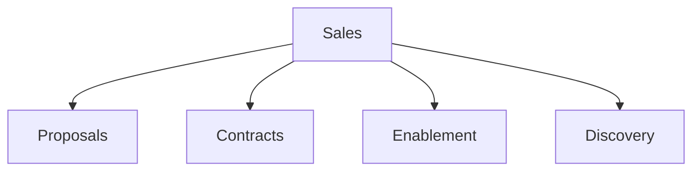

# Sales

Sales proposals, contracts, and enablement templates.

## Templates

| Template                                                     | Description     |
| ------------------------------------------------------------ | --------------- |
| [sales_proposal.md](sales_proposal.md)                       | Sales proposals |
| [sales_contract.md](sales_contract.md)                       | Sales contracts |
| [rfp_response.md](rfp_response.md)                           | RFP responses   |
| [demo_script_value_based.md](demo_script_value_based.md)     | Demo scripts    |
| [discovery_call_script_b2b.md](discovery_call_script_b2b.md) | Discovery calls |

## Structure

See [Parent](../SKILL.md) for all categories.
