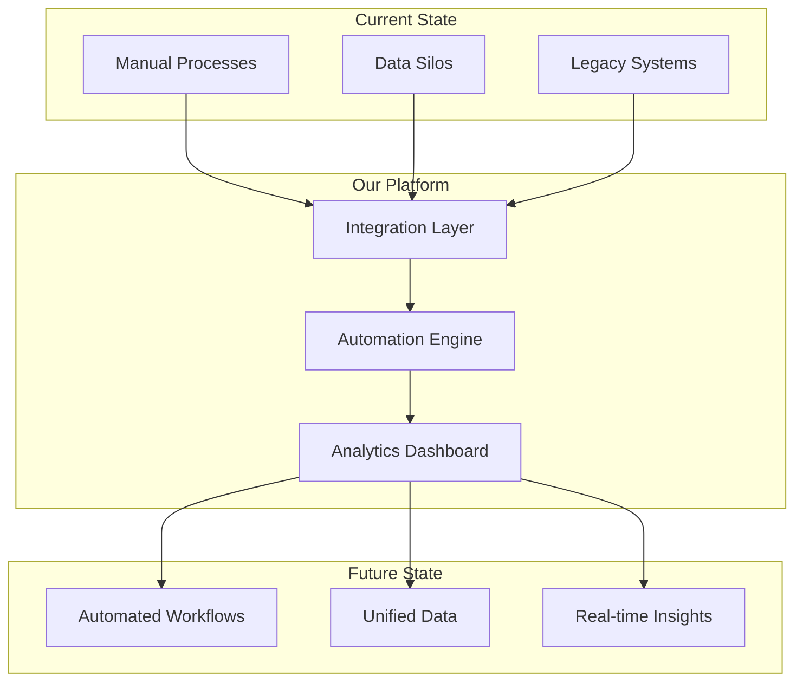
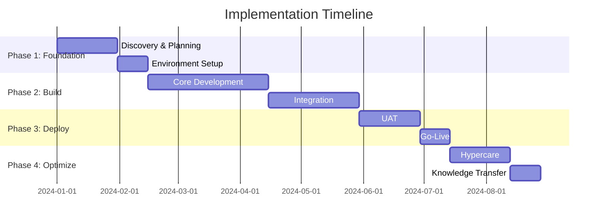

# Sales Proposal (Advanced)

<!-- Comprehensive sales proposal with diagrams, ROI calculations, and implementation planning -->

---

## Document Control

| Field        | Value                                          |
| ------------ | ---------------------------------------------- |
| **Template** | Sales Proposal (Advanced)                      |
| **Version**  | 1.0                                            |
| **Tiers**    | Simple → Intermediate → **Advanced**           |
| **Features** | Diagrams, LaTeX Math, Full Implementation Plan |

---

## Executive Summary

### Value Proposition

Our solution delivers **$[X,XXX,XXX]** in quantifiable value over [5] years.

### ROI Analysis

$$ROI = \frac{Net\ Benefit}{Investment\ Cost} \times 100\% = \frac{\$[X] - \$[Y]}{\$[Y]} \times 100\% = [XXX]\%$$

### Investment Highlights

| Metric                 | Value        |
| ---------------------- | ------------ |
| **Total Investment**   | $[X,XXX,XXX] |
| **NPV (10% discount)** | $[X,XXX,XXX] |
| **IRR**                | [XX]%        |
| **Payback Period**     | [X.X] months |

---

## Solution Architecture



### Technology Stack

| Layer              | Components                      |
| ------------------ | ------------------------------- |
| **Frontend**       | React, TypeScript, Tailwind CSS |
| **Backend**        | Node.js, Python, GraphQL        |
| **Database**       | PostgreSQL, Redis, ClickHouse   |
| **Infrastructure** | AWS/GCP, Kubernetes, Terraform  |
| **Security**       | OAuth 2.0, SAML 2.0, AES-256    |

---

## Financial Analysis

### Investment Breakdown

$$Total\ Investment = \sum_{i=1}^{n} C_i = C_{software} + C_{implementation} + C_{training} + C_{maintenance}$$

| Cost Category     | Year 1   | Year 2   | Year 3   | Year 4   | Year 5   |
| ----------------- | -------- | -------- | -------- | -------- | -------- |
| Software Licenses | $[X]     | $[X]     | $[X]     | $[X]     | $[X]     |
| Implementation    | $[X]     | $[0]     | $[0]     | $[0]     | $[0]     |
| Training          | $[X]     | $[X]     | $[0]     | $[0]     | $[0]     |
| Support           | $[X]     | $[X]     | $[X]     | $[X]     | $[X]     |
| **Total**         | **$[X]** | **$[X]** | **$[X]** | **$[X]** | **$[X]** |

### Benefit Analysis

$$NPV = \sum_{t=0}^{n} \frac{CF_t}{(1+r)^t} - C_0$$

| Benefit Category   | Year 1   | Year 2   | Year 3   | Year 4   | Year 5   |
| ------------------ | -------- | -------- | -------- | -------- | -------- |
| Labor Savings      | $[X]     | $[X]     | $[X]     | $[X]     | $[X]     |
| Efficiency Gains   | $[X]     | $[X]     | $[X]     | $[X]     | $[X]     |
| Revenue Growth     | $[X]     | $[X]     | $[X]     | $[X]     | $[X]     |
| Risk Mitigation    | $[X]     | $[X]     | $[X]     | $[X]     | $[X]     |
| **Total Benefits** | **$[X]** | **$[X]** | **$[X]** | **$[X]** | **$[X]** |

### Cash Flow Projection

```mermaid
xychart-beta
    title "5-Year Cash Flow Projection"
    x-axis [Year 1, Year 2, Year 3, Year 4, Year 5]
    y-axis "Amount ($K)" 0 --> 500
    bar [Benefits] data [-50, 150, 250, 300, 350]
    bar [Costs] data [200, 50, 50, 50, 50]
    line [Net Cash Flow] data [-250, 100, 200, 250, 300]
```

### Sensitivity Analysis

| Scenario                        | NPV  | IRR  | Payback |
| ------------------------------- | ---- | ---- | ------- |
| **Base Case**                   | $[X] | [X]% | [X] mo  |
| **Optimistic (+20% benefits)**  | $[X] | [X]% | [X] mo  |
| **Pessimistic (-20% benefits)** | $[X] | [X]% | [X] mo  |

---

## Implementation Roadmap



### Phase Details

| Phase                  | Duration | Key Deliverables                    | Success Criteria  |
| ---------------------- | -------- | ----------------------------------- | ----------------- |
| **Phase 1: Discovery** | 6 weeks  | Requirements doc, architecture plan | Sign-off on scope |
| **Phase 2: Build**     | 12 weeks | Working solution, integrations      | UAT ready         |
| **Phase 3: Deploy**    | 6 weeks  | Production system, training         | Go-live achieved  |
| **Phase 4: Optimize**  | 6 weeks  | Documentation, optimization         | Steady state      |

---

## Risk Assessment

### Risk Matrix

```mermaid
quadrantChart
    title Risk Impact vs Probability
    x-axis Low Probability --> High Probability
    y-axis Low Impact --> High Impact
    quadrant-1 Critical (High Priority)
    quadrant-2 Monitor Closely
    quadrant-3 Acceptable Risk
    quadrant-4 Low Priority
    "Integration Complexity": [0.7, 0.8]
    "User Adoption": [0.6, 0.7]
    "Timeline Slippage": [0.5, 0.6]
    "Budget Overrun": [0.4, 0.7]
    "Technical Issues": [0.5, 0.5]
    "Vendor Dependency": [0.3, 0.4]
```

### Mitigation Strategies

| Risk               | Likelihood | Impact | Mitigation                            | Owner |
| ------------------ | ---------- | ------ | ------------------------------------- | ----- |
| Integration delays | Medium     | High   | Early POC, dedicated integration team | PM    |
| User adoption      | Medium     | High   | Change management, champions program  | CSM   |
| Scope creep        | High       | Medium | Strict change control, weekly reviews | PM    |

---

## Success Metrics

### KPI Dashboard

$$\text{Performance Score} = \frac{\sum_{i=1}^{n} \frac{Actual_i}{Target_i} \times Weight_i}{\sum_{i=1}^{n} Weight_i} \times 100\%$$

| KPI                | Baseline | Target  | Measurement       |
| ------------------ | -------- | ------- | ----------------- |
| Process Efficiency | [X] hrs  | [Y] hrs | Time tracking     |
| Cost Savings       | $[0]     | $[X]/yr | Financial reports |
| User Adoption      | [0]%     | [X]%    | Analytics         |
| System Uptime      | [X]%     | [99.9]% | Monitoring        |
| Support Tickets    | [X]/mo   | [Y]/mo  | Ticketing system  |

---

## Next Steps

### Decision Timeline

| Step                   | Owner    | Due Date         |
| ---------------------- | -------- | ---------------- |
| Proposal Review        | [Client] | [Date + 7 days]  |
| Technical Q&A          | [Both]   | [Date + 14 days] |
| Executive Presentation | [Us]     | [Date + 21 days] |
| Contract Negotiation   | [Both]   | [Date + 30 days] |
| Project Kickoff        | [Both]   | [Date + 45 days] |

### Required Resources

- [ ] Executive sponsor commitment
- [ ] Project team allocation
- [ ] Budget approval
- [ ] Technical environment access
- [ ] Stakeholder alignment

---

## Appendices

### Appendix A: Detailed Technical Specifications

### Appendix B: Complete Financial Model

### Appendix C: Security Assessment

### Appendix D: Reference Customers

### Appendix E: Team Bios and Certifications

---

_Prepared following McKinsey MECE principles. All calculations use standard NPV methodology with 10% discount rate._
