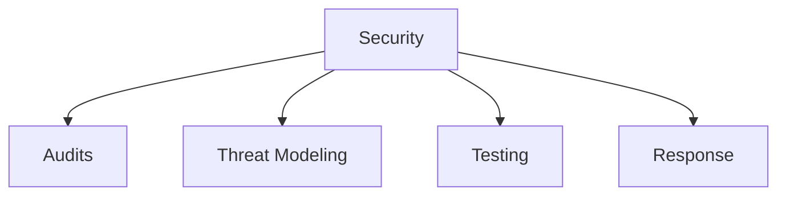

# Security

Security audits, assessments, and incident response templates.

## Templates

| Template                                                                 | Description           |
| ------------------------------------------------------------------------ | --------------------- |
| [security_audit.md](security_audit.md)                                   | Security audits       |
| [threat_model.md](threat_model.md)                                       | Threat modeling       |
| [penetration_test.md](penetration_test.md)                               | Security testing      |
| [incident_response.md](incident_response.md)                             | Incident response     |
| [vulnerability_assessment_report.md](vulnerability_assessment_report.md) | Vulnerability reports |

## Structure

See [Parent](../SKILL.md) for all categories.
