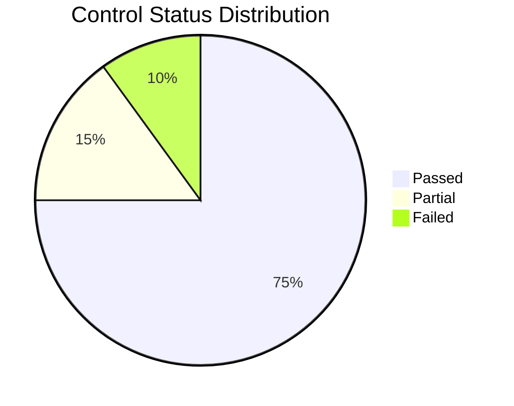

# Security Compliance Checklist

<!-- Control verification for multiple frameworks -->

---

## Document Control

| Field            | Value                        |
| ---------------- | ---------------------------- |
| **Checklist ID** | CL-[YYYY]-[NNN]              |
| **Version**      | [X.Y.Z]                      |
| **Date**         | [YYYY-MM-DD]                 |
| **Assessor**     | [Name, Role]                 |
| **Scope**        | [Systems/Departments]        |
| **Frameworks**   | ISO 27001 / SOC 2 / NIST CSF |
| **Status**       | In Progress / Complete       |

---

## Executive Summary

### Assessment Overview

| Framework | Controls | Passed | Failed | Partial | Score |
| --------- | -------- | ------ | ------ | ------- | ----- |
| ISO 27001 | [N]      | [N]    | [N]    | [N]     | [X]%  |
| SOC 2     | [N]      | [N]    | [N]    | [N]     | [X]%  |
| NIST CSF  | [N]      | [N]    | [N]    | [N]     | [X]%  |

### Overall Compliance Score

$$\text{Compliance Score} = \frac{\text{Passed Controls}}{\text{Total Controls}} \times 100$$

---

## ISO 27001:2022 Controls

### Organizational Controls (Clause 5)

| Control | Title                                   | Status | Evidence    | Notes |
| ------- | --------------------------------------- | ------ | ----------- | ----- |
| 5.1     | Policies for information security       | ⬜     | [Doc]       |       |
| 5.2     | Information security roles              | ⬜     | [Org chart] |       |
| 5.3     | Segregation of duties                   | ⬜     | [Matrix]    |       |
| 5.4     | Management responsibilities             | ⬜     | [Minutes]   |       |
| 5.5     | Contact with special interest groups    | ⬜     | [List]      |       |
| 5.6     | Information security project management | ⬜     | [Process]   |       |

### People Controls (Clause 6)

| Control | Title                                | Status | Evidence    | Notes |
| ------- | ------------------------------------ | ------ | ----------- | ----- |
| 6.1     | Screening                            | ⬜     | [Policy]    |       |
| 6.2     | Terms and conditions                 | ⬜     | [Contracts] |       |
| 6.3     | Information security awareness       | ⬜     | [Training]  |       |
| 6.4     | Disciplinary process                 | ⬜     | [Policy]    |       |
| 6.5     | Responsibilities after termination   | ⬜     | [Checklist] |       |
| 6.6     | Confidentiality agreements           | ⬜     | [NDAs]      |       |
| 6.7     | Remote working                       | ⬜     | [Policy]    |       |
| 6.8     | Information security event reporting | ⬜     | [Process]   |       |

### Physical Controls (Clause 7)

| Control | Title                               | Status | Evidence     | Notes |
| ------- | ----------------------------------- | ------ | ------------ | ----- |
| 7.1     | Physical security perimeters        | ⬜     | [Assessment] |       |
| 7.2     | Physical entry                      | ⬜     | [Logs]       |       |
| 7.3     | Securing offices                    | ⬜     | [Inspection] |       |
| 7.4     | Physical security monitoring        | ⬜     | [Cameras]    |       |
| 7.5     | Protecting against physical threats | ⬜     | [Assessment] |       |
| 7.6     | Working in secure areas             | ⬜     | [Policy]     |       |
| 7.7     | Clear desk and screen               | ⬜     | [Policy]     |       |
| 7.8     | Equipment siting                    | ⬜     | [Assessment] |       |
| 7.9     | Security of assets off-premises     | ⬜     | [Policy]     |       |
| 7.10    | Storage media                       | ⬜     | [Inventory]  |       |
| 7.11    | Supporting utilities                | ⬜     | [Assessment] |       |
| 7.12    | Cabling security                    | ⬜     | [Inspection] |       |
| 7.13    | Equipment maintenance               | ⬜     | [Logs]       |       |
| 7.14    | Secure disposal                     | ⬜     | [Process]    |       |

### Technological Controls (Clause 8)

| Control | Title                                   | Status | Evidence       | Notes |
| ------- | --------------------------------------- | ------ | -------------- | ----- |
| 8.1     | User endpoint devices                   | ⬜     | [Policy]       |       |
| 8.2     | Privileged access rights                | ⬜     | [Review]       |       |
| 8.3     | Information access restriction          | ⬜     | [Config]       |       |
| 8.4     | Access to source code                   | ⬜     | [Policy]       |       |
| 8.5     | Secure authentication                   | ⬜     | [MFA logs]     |       |
| 8.6     | Capacity management                     | ⬜     | [Reports]      |       |
| 8.7     | Protection against malware              | ⬜     | [AV logs]      |       |
| 8.8     | Management of technical vulnerabilities | ⬜     | [Scan reports] |       |
| 8.9     | Configuration management                | ⬜     | [Baselines]    |       |
| 8.10    | Deletion of information                 | ⬜     | [Process]      |       |
| 8.11    | Data masking                            | ⬜     | [Policy]       |       |
| 8.12    | Data leakage prevention                 | ⬜     | [DLP logs]     |       |
| 8.13    | Information backup                      | ⬜     | [Test results] |       |
| 8.14    | Redundancy                              | ⬜     | [Architecture] |       |
| 8.15    | Logging                                 | ⬜     | [Log review]   |       |
| 8.16    | Monitoring                              | ⬜     | [Alerts]       |       |
| 8.17    | Clock synchronization                   | ⬜     | [Config]       |       |
| 8.18    | Use of privileged utility programs      | ⬜     | [Policy]       |       |
| 8.19    | Installation of software                | ⬜     | [Whitelist]    |       |
| 8.20    | Network security                        | ⬜     | [Architecture] |       |
| 8.21    | Security of network services            | ⬜     | [Agreements]   |       |
| 8.22    | Segregation of networks                 | ⬜     | [Diagram]      |       |
| 8.23    | Web filtering                           | ⬜     | [Proxy config] |       |
| 8.24    | Use of cryptography                     | ⬜     | [Policy]       |       |
| 8.25    | Secure development life cycle           | ⬜     | [Process]      |       |
| 8.26    | Application security requirements       | ⬜     | [Checklist]    |       |
| 8.27    | Secure system architecture              | ⬜     | [Review]       |       |
| 8.28    | Secure coding                           | ⬜     | [Guidelines]   |       |
| 8.29    | Security testing                        | ⬜     | [Reports]      |       |
| 8.30    | Outsourced development                  | ⬜     | [Contracts]    |       |
| 8.31    | Separation of development environments  | ⬜     | [Architecture] |       |
| 8.32    | Change management                       | ⬜     | [Process]      |       |
| 8.33    | Test information                        | ⬜     | [Policy]       |       |
| 8.34    | Protection of information systems       | ⬜     | [Audit logs]   |       |

---

## SOC 2 Trust Services Criteria

### Security (Common Criteria)

| CC    | Title                       | Status | Evidence             | Notes |
| ----- | --------------------------- | ------ | -------------------- | ----- |
| CC6.1 | Logical access security     | ⬜     | [Access review]      |       |
| CC6.2 | Access removal              | ⬜     | [Termination log]    |       |
| CC6.3 | Access establishment        | ⬜     | [Workflow]           |       |
| CC6.4 | Access modification         | ⬜     | [Workflow]           |       |
| CC6.5 | Access review               | ⬜     | [Quarterly review]   |       |
| CC6.6 | Access credentials          | ⬜     | [Password policy]    |       |
| CC6.7 | Access restrictions         | ⬜     | [Firewall rules]     |       |
| CC6.8 | Security infrastructure     | ⬜     | [Architecture]       |       |
| CC7.1 | Security detection          | ⬜     | [SIEM config]        |       |
| CC7.2 | Security monitoring         | ⬜     | [Alert review]       |       |
| CC7.3 | Security incident detection | ⬜     | [Playbooks]          |       |
| CC7.4 | Security incident response  | ⬜     | [IR plan]            |       |
| CC7.5 | Incident communication      | ⬜     | [Communication plan] |       |

### Availability

| A    | Title                    | Status | Evidence         | Notes |
| ---- | ------------------------ | ------ | ---------------- | ----- |
| A1.1 | Availability monitoring  | ⬜     | [Uptime reports] |       |
| A1.2 | Recovery point objective | ⬜     | [RPO definition] |       |
| A1.3 | Recovery time objective  | ⬜     | [RTO definition] |       |

### Confidentiality

| C    | Title                      | Status | Evidence | Notes |
| ---- | -------------------------- | ------ | -------- | ----- |
| C1.1 | Confidentiality agreements | ⬜     | [NDAs]   |       |
| C1.2 | Confidentiality procedures | ⬜     | [Policy] |       |

---

## NIST Cybersecurity Framework

### Identify

| Function | Category         | Subcategory | Status | Evidence     |
| -------- | ---------------- | ----------- | ------ | ------------ |
| ID.AM    | Asset Management | ID.AM-1     | ⬜     | [Inventory]  |
| ID.AM    | Asset Management | ID.AM-2     | ⬜     | [Inventory]  |
| ID.GV    | Governance       | ID.GV-1     | ⬜     | [Policy]     |
| ID.RA    | Risk Assessment  | ID.RA-1     | ⬜     | [Assessment] |
| ID.RM    | Risk Management  | ID.RM-1     | ⬜     | [Strategy]   |

### Protect

| Function | Category        | Subcategory | Status | Evidence     |
| -------- | --------------- | ----------- | ------ | ------------ |
| PR.AC    | Access Control  | PR.AC-1     | ⬜     | [Policy]     |
| PR.AC    | Access Control  | PR.AC-2     | ⬜     | [Config]     |
| PR.AT    | Awareness       | PR.AT-1     | ⬜     | [Training]   |
| PR.DS    | Data Security   | PR.DS-1     | ⬜     | [Encryption] |
| PR.IP    | Info Protection | PR.IP-1     | ⬜     | [Baselines]  |
| PR.MA    | Maintenance     | PR.MA-1     | ⬜     | [Schedule]   |
| PR.PT    | Protective Tech | PR.PT-1     | ⬜     | [Logs]       |

### Detect

| Function | Category   | Subcategory | Status | Evidence    |
| -------- | ---------- | ----------- | ------ | ----------- |
| DE.AE    | Anomalies  | DE.AE-1     | ⬜     | [SIEM]      |
| DE.CM    | Monitoring | DE.CM-1     | ⬜     | [Alerts]    |
| DE.DP    | Processes  | DE.DP-1     | ⬜     | [Playbooks] |

### Respond

| Function | Category          | Subcategory | Status | Evidence  |
| -------- | ----------------- | ----------- | ------ | --------- |
| RS.RP    | Response Planning | RS.RP-1     | ⬜     | [IR plan] |
| RS.CO    | Communications    | RS.CO-1     | ⬜     | [Plan]    |
| RS.AN    | Analysis          | RS.AN-1     | ⬜     | [Process] |
| RS.MI    | Mitigation        | RS.MI-1     | ⬜     | [Process] |
| RS.IM    | Improvements      | RS.IM-1     | ⬜     | [Reviews] |

### Recover

| Function | Category          | Subcategory | Status | Evidence  |
| -------- | ----------------- | ----------- | ------ | --------- |
| RC.RP    | Recovery Planning | RC.RP-1     | ⬜     | [DR plan] |
| RC.IM    | Improvements      | RC.IM-1     | ⬜     | [Reviews] |
| RC.CO    | Communications    | RC.CO-1     | ⬜     | [Plan]    |

---

## Gap Analysis

### Critical Gaps

| Gap     | Framework   | Risk   | Remediation | Priority |
| ------- | ----------- | ------ | ----------- | -------- |
| [Gap 1] | [Framework] | High   | [Action]    | P0       |
| [Gap 2] | [Framework] | Medium | [Action]    | P1       |

### Remediation Plan

| Control   | Gap           | Action   | Owner  | Due Date | Status |
| --------- | ------------- | -------- | ------ | -------- | ------ |
| [Control] | [Description] | [Action] | [Name] | [Date]   | ⬜     |

---

## Evidence Inventory

| Control   | Evidence Type | Location | Date   | Valid |
| --------- | ------------- | -------- | ------ | ----- |
| [Control] | [Type]        | [Path]   | [Date] | ⬜    |

---

## Sign-off

| Role     | Name   | Signature      | Date   |
| -------- | ------ | -------------- | ------ |
| Assessor | [Name] | ****\_\_\_**** | [Date] |
| Reviewer | [Name] | ****\_\_\_**** | [Date] |
| Approver | [Name] | ****\_\_\_**** | [Date] |

---

_Last updated: [Date]_

---

## See Also

- [Security Audit](./security_audit.md) — Detailed security assessment
- [Penetration Test](./penetration_test.md) — Technical testing
- [Incident Response](./incident_response.md) — Incident handling
