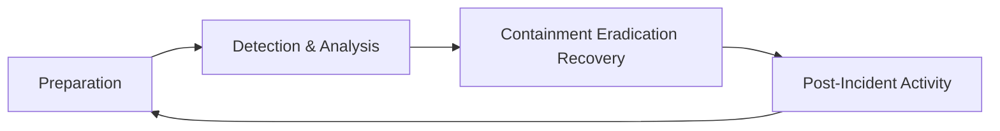
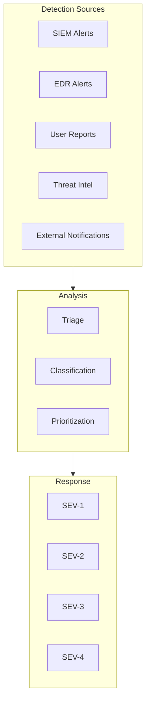
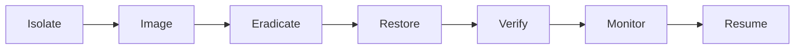
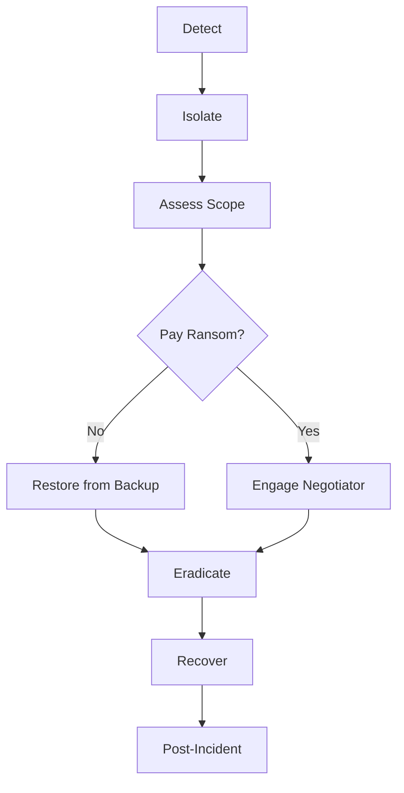
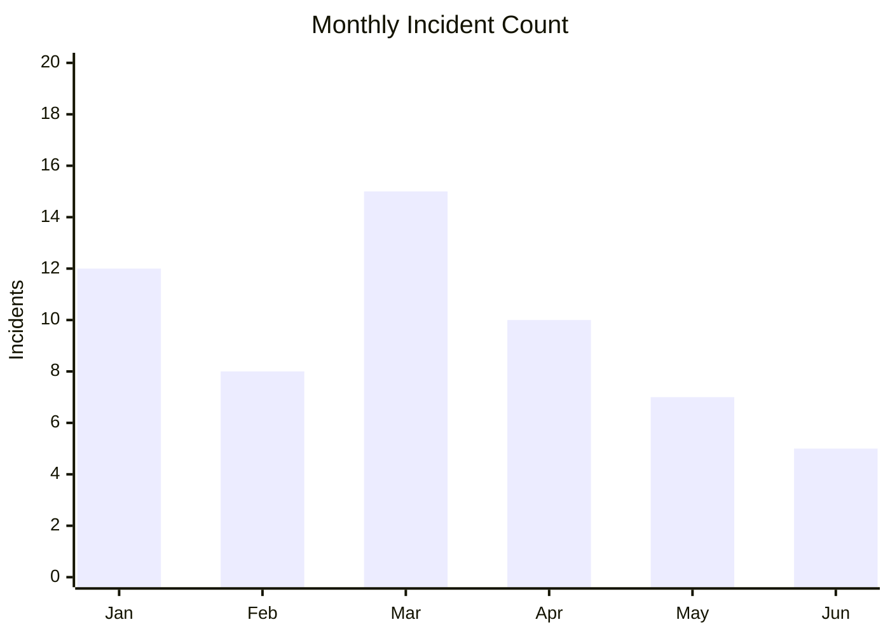

# Incident Response Plan

<!-- Security incident handling following NIST SP 800-61 -->

---

## Document Control

| Field            | Value            |
| ---------------- | ---------------- |
| **Plan ID**      | IRP-[YYYY]-[NNN] |
| **Version**      | [X.Y.Z]          |
| **Date**         | [YYYY-MM-DD]     |
| **Author**       | [Name, Role]     |
| **Approved By**  | [Name, Title]    |
| **Review Cycle** | Quarterly        |
| **Status**       | Draft / Approved |

> [!IMPORTANT]
> This plan must be reviewed quarterly and after each significant incident.

---

## Executive Summary

### Purpose

This document establishes procedures for responding to security incidents including:

- Malware infections
- Unauthorized access
- Data breaches
- Denial of service attacks
- Insider threats

### Incident Severity Levels

| Level     | Description | Response Time | Examples                         |
| --------- | ----------- | ------------- | -------------------------------- |
| **SEV-1** | Critical    | 15 minutes    | Active breach, data exfiltration |
| **SEV-2** | High        | 1 hour        | Ransomware, system compromise    |
| **SEV-3** | Medium      | 4 hours       | Malware, policy violation        |
| **SEV-4** | Low         | 24 hours      | Phishing attempts, port scans    |

---

## Incident Response Lifecycle

---

## Phase 1: Preparation

### Incident Response Team

| Role                | Name   | Contact       | Responsibility          |
| ------------------- | ------ | ------------- | ----------------------- |
| Incident Commander  | [Name] | [Phone/Email] | Overall coordination    |
| Technical Lead      | [Name] | [Phone/Email] | Technical response      |
| Communications Lead | [Name] | [Phone/Email] | External communications |
| Legal Counsel       | [Name] | [Phone/Email] | Legal/regulatory        |
| HR Representative   | [Name] | [Phone/Email] | Personnel issues        |

### Contact Information

| Organization    | Contact  | Purpose            |
| --------------- | -------- | ------------------ |
| Law Enforcement | [Number] | Criminal activity  |
| Legal           | [Number] | Legal advice       |
| Insurance       | [Number] | Cyber insurance    |
| Forensics       | [Number] | External forensics |

### Tools & Resources

| Category      | Tool        | Purpose            |
| ------------- | ----------- | ------------------ |
| Monitoring    | Splunk      | Log analysis       |
| EDR           | CrowdStrike | Endpoint detection |
| SIEM          | Sentinel    | Event correlation  |
| Forensics     | FTK         | Disk imaging       |
| Communication | Slack       | Team coordination  |

---

## Phase 2: Detection & Analysis

### Detection Sources

### Initial Assessment

| Question       | Information Needed               |
| -------------- | -------------------------------- |
| What happened? | Incident description             |
| When?          | Detection time, occurrence time  |
| Where?         | Affected systems                 |
| Who?           | Reporter, potential threat actor |
| How?           | Attack vector                    |
| Impact?        | Data, systems, business          |

### Classification Matrix

| Indicator     | SEV-1     | SEV-2     | SEV-3  | SEV-4     |
| ------------- | --------- | --------- | ------ | --------- |
| Data breach   | Confirmed | Suspected | No     | No        |
| Systems down  | Critical  | Multiple  | Single | None      |
| Active attack | Yes       | Recent    | Past   | Attempted |
| Public impact | High      | Medium    | Low    | None      |

---

## Phase 3: Containment, Eradication & Recovery

### Containment Strategies

#### Short-term Containment

| Action          | Purpose               | Risk               |
| --------------- | --------------------- | ------------------ |
| Isolate system  | Stop spread           | Service disruption |
| Block IP        | Stop attack           | False positive     |
| Disable account | Stop lateral movement | User impact        |

#### Long-term Containment

| Action                | Timeline | Owner    |
| --------------------- | -------- | -------- |
| Patch vulnerabilities | 24 hours | Security |
| Update firewall rules | 4 hours  | Network  |
| Rotate credentials    | 2 hours  | IAM      |

### Eradication

| Step | Action                     | Verification     |
| ---- | -------------------------- | ---------------- |
| 1    | Remove malware             | Scan clean       |
| 2    | Delete backdoors           | Forensics review |
| 3    | Patch vulnerabilities      | Vuln scan        |
| 4    | Reset compromised accounts | Access review    |

### Recovery

| Step | Action                      | Verification      |
| ---- | --------------------------- | ----------------- |
| 1    | Restore from clean backup   | Integrity check   |
| 2    | Rebuild compromised systems | Hardening scan    |
| 3    | Reconnect to network        | Monitoring review |
| 4    | Resume operations           | Business sign-off |

---

## Phase 4: Post-Incident Activity

### Incident Timeline

| Time   | Event   | Actor | Notes   |
| ------ | ------- | ----- | ------- |
| [Time] | [Event] | [Who] | [Notes] |
| [Time] | [Event] | [Who] | [Notes] |

### Lessons Learned

**What went well:**

1. [Item 1]
2. [Item 2]

**What could be improved:**

1. [Item 1]
2. [Item 2]

**Action items:**
| Action | Owner | Due Date | Status |
| -------- | ------- | ---------- | -------- |
| [Action] | [Name] | [Date] | ⬜ |

---

## Communication Plan

### Internal Communication

| Audience   | Timing    | Method     | Message  |
| ---------- | --------- | ---------- | -------- |
| IR Team    | Immediate | Slack      | Alert    |
| Leadership | 1 hour    | Email/Call | Status   |
| All Staff  | 4 hours   | Email      | Guidance |

### External Communication

| Audience        | Timing    | Method    | Owner |
| --------------- | --------- | --------- | ----- |
| Customers       | 24 hours  | Email     | Comms |
| Regulators      | 72 hours  | Form      | Legal |
| Media           | As needed | Statement | Comms |
| Law Enforcement | As needed | Report    | Legal |

### Breach Notification Requirements

| Regulation | Timeline      | Requirement           |
| ---------- | ------------- | --------------------- |
| GDPR       | 72 hours      | Supervisory authority |
| State laws | Varies        | Affected individuals  |
| Contracts  | Per agreement | Business partners     |

---

## Playbooks

### Playbook: Ransomware

**Steps:**

1. **Isolate affected systems immediately**
2. **Do not pay ransom without legal/executive approval**
3. **Preserve evidence for forensics**
4. **Restore from clean backups**
5. **Patch vulnerabilities before reconnecting**

### Playbook: Data Breach

**Steps:**

1. **Confirm breach scope**
2. **Contain exposure**
3. **Assess regulatory notification requirements**
4. **Notify affected parties per timeline**
5. **Provide credit monitoring if required**

### Playbook: Insider Threat

**Steps:**

1. **Preserve evidence discreetly**
2. **Engage HR and Legal**
3. **Monitor without alerting suspect**
4. **Coordinate termination if needed**
5. **Review access logs for scope**

---

## Metrics

### Key Performance Indicators

| Metric                      | Target     | Current |
| --------------------------- | ---------- | ------- |
| Mean Time to Detect (MTTD)  | < 24 hours | [Hours] |
| Mean Time to Respond (MTTR) | < 4 hours  | [Hours] |
| Mean Time to Contain (MTTC) | < 8 hours  | [Hours] |
| Incident Escalation Rate    | < 10%      | [X]%    |

### Incident Trends

---

## Appendices

### A. Contact Directory

[Complete contact list]

### B. System Inventory

[Critical systems and owners]

### C. Forensics Procedures

[Evidence collection guidelines]

---

_Last updated: [Date]_

---

## See Also

- [Security Audit](./security_audit.md) — Security assessment
- [Penetration Test](./penetration_test.md) — Vulnerability testing
- [Post-Mortem](../engineering/post_mortem.md) — Incident analysis
