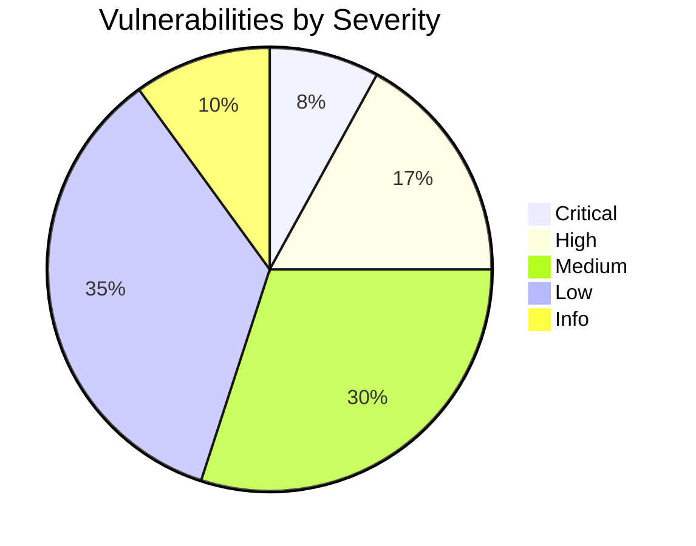
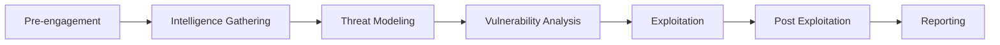
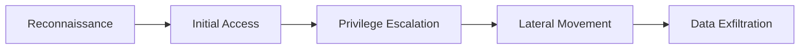
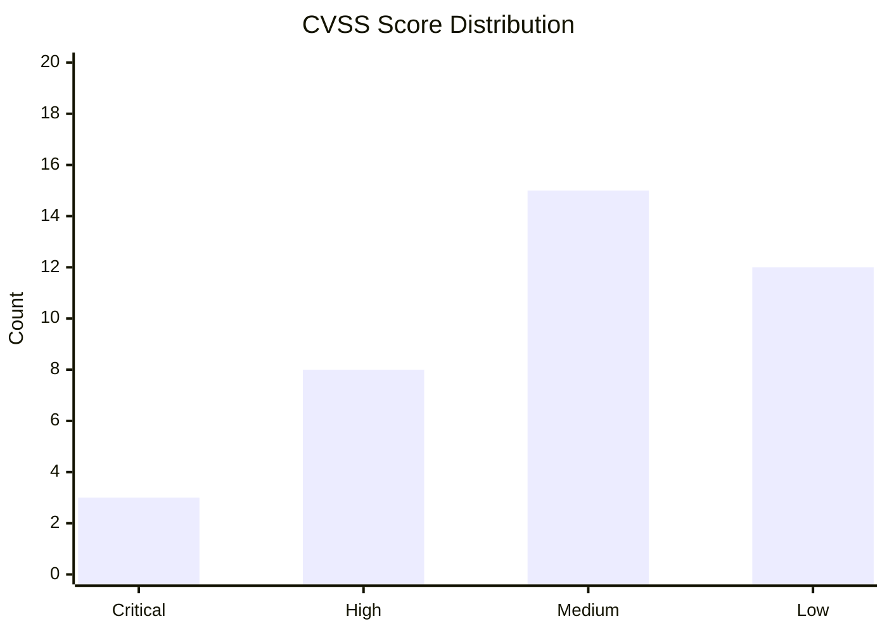

# Penetration Test Report

<!-- Technical security assessment following PTES methodology -->

---

## Document Control

| Field              | Value                 |
| ------------------ | --------------------- |
| **Report ID**      | PT-[YYYY]-[NNN]       |
| **Version**        | [X.Y.Z]               |
| **Date**           | [YYYY-MM-DD]          |
| **Tester**         | [Name, Certification] |
| **Reviewed By**    | [Name, Certification] |
| **Scope**          | [Systems tested]      |
| **Classification** | Confidential          |
| **Status**         | Draft / Final         |

> [!WARNING]
> This report contains sensitive vulnerability information. Handle with extreme care.

---

## Executive Summary

### Engagement Overview

| Attribute          | Value                                                 |
| ------------------ | ----------------------------------------------------- |
| **Client**         | [Organization]                                        |
| **Test Type**      | Black Box / Gray Box / White Box                      |
| **Duration**       | [Start] to [End]                                      |
| **Systems Tested** | [N]                                                   |
| **Findings**       | [N] critical, [N] high, [N] medium, [N] low, [N] info |

### Risk Summary



### Critical Findings Summary

1. **[Vulnerability 1]:** [Brief description] — **Immediate action required**
2. **[Vulnerability 2]:** [Brief description] — **Immediate action required**
3. **[Vulnerability 3]:** [Brief description] — **Immediate action required**

---

## Scope

### In Scope

| System     | IP/URL   | Environment | Test Type |
| ---------- | -------- | ----------- | --------- |
| [System 1] | [IP/URL] | Production  | Full      |
| [System 2] | [IP/URL] | Staging     | Full      |
| [System 3] | [IP/URL] | Production  | Limited   |

### Out of Scope

| System   | Reason   |
| -------- | -------- |
| [System] | [Reason] |

### Testing Methodology



---

## Technical Findings

### Critical Severity

#### VULN-001: [Vulnerability Name]

| Attribute           | Value                      |
| ------------------- | -------------------------- |
| **Severity**        | Critical                   |
| **CVSS v3.1**       | [X.X]                      |
| **CWE**             | [CWE-XXX]                  |
| **Affected System** | [System]                   |
| **Attack Vector**   | Network / Local / Physical |

**Description:**
[Technical description of the vulnerability]

**Proof of Concept:**

```bash
# Exploit command
[Command used to exploit]

# Result
[Output showing successful exploitation]
```

**Impact:**

- Confidentiality: [Impact]
- Integrity: [Impact]
- Availability: [Impact]

**Remediation:**

1. [Step 1]
2. [Step 2]
3. [Step 3]

**References:**

- [CVE-XXXX-XXXX]
- [Vendor advisory]

### High Severity

#### VULN-002: [Vulnerability Name]

| Attribute     | Value     |
| ------------- | --------- |
| **Severity**  | High      |
| **CVSS v3.1** | [X.X]     |
| **CWE**       | [CWE-XXX] |

**Description:**
[Description]

**Proof of Concept:**

```
[Evidence]
```

**Remediation:**

1. [Step 1]
2. [Step 2]

---

## Attack Narrative

### Attack Path 1: [Scenario Name]



**Step 1: Reconnaissance**

- [Actions taken]
- [Tools used]
- [Information gathered]

**Step 2: Initial Access**

- [Vulnerability exploited]
- [Payload used]
- [Result]

**Step 3: Privilege Escalation**

- [Technique used]
- [Result]

**Step 4: Lateral Movement**

- [Systems accessed]

**Step 5: Data Access**

- [Data accessed]
- [Sensitivity level]

---

## Vulnerability Categories

### Web Application

| Vuln ID  | Name   | Severity | OWASP Category                  |
| -------- | ------ | -------- | ------------------------------- |
| VULN-001 | [Name] | Critical | A01:2021-Broken Access Control  |
| VULN-002 | [Name] | High     | A02:2021-Cryptographic Failures |

### Network

| Vuln ID  | Name   | Severity | Port/Service |
| -------- | ------ | -------- | ------------ |
| VULN-010 | [Name] | High     | 445/SMB      |
| VULN-011 | [Name] | Medium   | 22/SSH       |

### Infrastructure

| Vuln ID  | Name   | Severity | System   |
| -------- | ------ | -------- | -------- |
| VULN-020 | [Name] | Critical | [System] |
| VULN-021 | [Name] | High     | [System] |

---

## Risk Scoring

### CVSS v3.1 Scores



**CVSS Calculation:**

$$\text{CVSS Score} = \text{Base Score} \times \text{Temporal} \times \text{Environmental}$$

| Vuln ID  | Base | Temporal | Environmental | Final |
| -------- | ---- | -------- | ------------- | ----- |
| VULN-001 | 9.8  | 1.0      | 1.0           | 9.8   |
| VULN-002 | 8.5  | 0.95     | 1.0           | 8.1   |

---

## Remediation Roadmap

### Immediate (0-7 days)

| Vuln ID  | Action   | Owner  | Effort  |
| -------- | -------- | ------ | ------- |
| VULN-001 | [Action] | [Name] | [Hours] |
| VULN-002 | [Action] | [Name] | [Hours] |

### Short-term (8-30 days)

| Vuln ID  | Action   | Owner  | Effort  |
| -------- | -------- | ------ | ------- |
| VULN-003 | [Action] | [Name] | [Hours] |

### Long-term (31-90 days)

| Vuln ID  | Action   | Owner  | Effort  |
| -------- | -------- | ------ | ------- |
| VULN-010 | [Action] | [Name] | [Hours] |

---

## Retest Results

### Retest Summary

| Original Finding | Severity | Retest Date | Status        |
| ---------------- | -------- | ----------- | ------------- |
| VULN-001         | Critical | [Date]      | ✅ Remediated |
| VULN-002         | High     | [Date]      | ⚠️ Partial    |

---

## Tools Used

| Category     | Tool       | Version   | Purpose                |
| ------------ | ---------- | --------- | ---------------------- |
| Scanner      | Nessus     | [Version] | Vulnerability scanning |
| Web          | Burp Suite | [Version] | Web app testing        |
| Network      | Nmap       | [Version] | Port scanning          |
| Exploitation | Metasploit | [Version] | Exploit framework      |

---

## Appendices

### A. Detailed Vulnerability List

[Complete vulnerability inventory]

### B. Evidence Screenshots

[Supporting screenshots]

### C. Raw Scan Output

[Scanner output files]

---

_Last updated: [Date]_

---

## See Also

- [Security Audit](./security_audit.md) — Control assessment
- [Vulnerability Assessment](./vulnerability_assessment_report.md) — Automated scanning
- [Incident Response](./incident_response.md) — Breach response procedures
