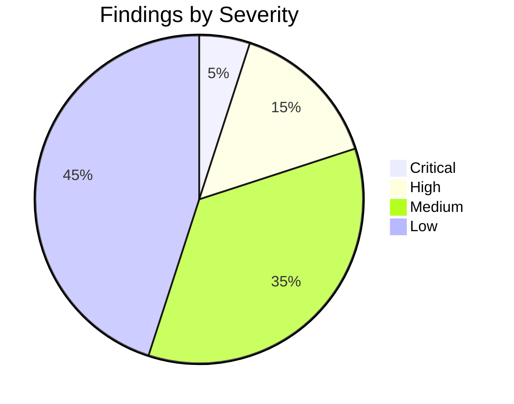
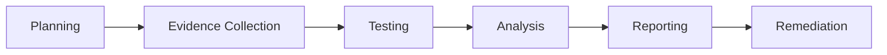
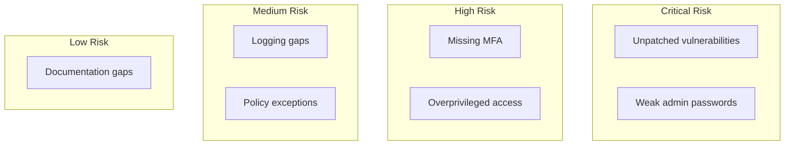

# Security Audit Report

<!-- Comprehensive security assessment following industry standards -->

---

## Document Control

| Field              | Value                         |
| ------------------ | ----------------------------- |
| **Audit ID**       | AUD-[YYYY]-[NNN]              |
| **Version**        | [X.Y.Z]                       |
| **Date**           | [YYYY-MM-DD]                  |
| **Auditor**        | [Name, Role]                  |
| **Reviewed By**    | [Name, Role]                  |
| **Scope**          | [Systems/Departments covered] |
| **Classification** | Confidential                  |
| **Status**         | Draft / Final                 |

> [!IMPORTANT]
> This document contains sensitive security information. Distribution is restricted.

---

## Executive Summary

### Audit Overview

| Attribute           | Value                                                   |
| ------------------- | ------------------------------------------------------- |
| **Audit Period**    | [Start] to [End]                                        |
| **Systems Audited** | [N] systems                                             |
| **Controls Tested** | [N] controls                                            |
| **Findings**        | [N] total ([N] critical, [N] high, [N] medium, [N] low) |
| **Overall Rating**  | [Pass/Conditional/Fail]                                 |

### Risk Summary



### Key Findings

1. **[Critical]:** [Brief description]
2. **[High]:** [Brief description]
3. **[Medium]:** [Brief description]

### Recommendations

1. [Priority recommendation 1]
2. [Priority recommendation 2]
3. [Priority recommendation 3]

---

## Audit Scope

### In Scope

| Category           | Items  |
| ------------------ | ------ |
| **Infrastructure** | [List] |
| **Applications**   | [List] |
| **Data**           | [List] |
| **Processes**      | [List] |
| **Third Parties**  | [List] |

### Out of Scope

| Category   | Items  | Reason   |
| ---------- | ------ | -------- |
| [Category] | [List] | [Reason] |

### Standards/Frameworks

| Framework | Version                 | Controls |
| --------- | ----------------------- | -------- |
| ISO 27001 | 2022                    | [N]      |
| NIST CSF  | 1.1                     | [N]      |
| SOC 2     | Trust Services Criteria | [N]      |

---

## Methodology

### Audit Approach



### Testing Methods

| Method               | Description             | Coverage    |
| -------------------- | ----------------------- | ----------- |
| Document Review      | Policy/procedure review | 100%        |
| Interview            | Stakeholder discussions | [N] people  |
| Technical Testing    | Vulnerability scans     | [N] systems |
| Configuration Review | Security settings       | [N] systems |
| Penetration Test     | Simulated attacks       | [Scope]     |

---

## Control Assessment

### Governance

| Control | Description               | Status | Evidence      | Rating            |
| ------- | ------------------------- | ------ | ------------- | ----------------- |
| GOV-001 | Security policy exists    | ✅     | Policy doc    | Satisfactory      |
| GOV-002 | Risk assessment conducted | ✅     | Risk register | Satisfactory      |
| GOV-003 | Security roles defined    | ⚠️     | Org chart     | Needs Improvement |

### Asset Management

| Control | Description                | Status | Evidence           | Rating            |
| ------- | -------------------------- | ------ | ------------------ | ----------------- |
| AST-001 | Asset inventory maintained | ✅     | CMDB               | Satisfactory      |
| AST-002 | Asset classification       | ⚠️     | Classification doc | Needs Improvement |
| AST-003 | Asset ownership assigned   | ❌     | -                  | Deficient         |

### Access Control

| Control | Description               | Status | Evidence      | Rating            |
| ------- | ------------------------- | ------ | ------------- | ----------------- |
| ACC-001 | User access review        | ✅     | Review logs   | Satisfactory      |
| ACC-002 | Privileged access managed | ⚠️     | PAM logs      | Needs Improvement |
| ACC-003 | MFA enforced              | ✅     | Azure AD      | Satisfactory      |
| ACC-004 | Least privilege           | ❌     | Access review | Deficient         |

### Cryptography

| Control | Description           | Status | Evidence      | Rating            |
| ------- | --------------------- | ------ | ------------- | ----------------- |
| CRY-001 | Encryption at rest    | ✅     | Config review | Satisfactory      |
| CRY-002 | Encryption in transit | ✅     | TLS scan      | Satisfactory      |
| CRY-003 | Key management        | ⚠️     | KMS audit     | Needs Improvement |

---

## Technical Findings

### Vulnerability Summary

| Severity | Count | Remediated | Open |
| -------- | ----- | ---------- | ---- |
| Critical | [N]   | [N]        | [N]  |
| High     | [N]   | [N]        | [N]  |
| Medium   | [N]   | [N]        | [N]  |
| Low      | [N]   | [N]        | [N]  |

### Critical Findings

#### Finding AUD-001: [Title]

| Attribute      | Value         |
| -------------- | ------------- |
| **Severity**   | Critical      |
| **CVSS Score** | [X.X]         |
| **System**     | [System name] |
| **Category**   | [Category]    |

**Description:**
[Detailed description of the vulnerability]

**Evidence:**

```
[Technical evidence, scan output, etc.]
```

**Risk:**
[Business impact and likelihood]

**Remediation:**

1. [Step 1]
2. [Step 2]
3. [Step 3]

**Timeline:** Immediate (within 7 days)

### High Findings

#### Finding AUD-002: [Title]

| Attribute    | Value         |
| ------------ | ------------- |
| **Severity** | High          |
| **System**   | [System name] |
| **Category** | [Category]    |

**Description:**
[Description]

**Remediation:**

1. [Step 1]
2. [Step 2]

**Timeline:** 30 days

---

## Compliance Assessment

### ISO 27001

| Annex Control | Description    | Status | Finding |
| ------------- | -------------- | ------ | ------- |
| A.5.1         | Policies       | ✅     | None    |
| A.9.1         | Access control | ⚠️     | ACC-004 |
| A.12.3        | Backup         | ❌     | BAK-001 |

### SOC 2 Trust Services Criteria

| Criteria | Description       | Status | Finding |
| -------- | ----------------- | ------ | ------- |
| CC6.1    | Logical access    | ⚠️     | ACC-002 |
| CC6.2    | Access removal    | ✅     | None    |
| CC7.2    | System monitoring | ⚠️     | MON-001 |

---

## Risk Assessment

### Risk Matrix



### Risk Register

| ID    | Risk   | Likelihood | Impact | Score    | Treatment |
| ----- | ------ | ---------- | ------ | -------- | --------- |
| R-001 | [Risk] | High       | High   | Critical | Mitigate  |
| R-002 | [Risk] | Medium     | High   | High     | Mitigate  |
| R-003 | [Risk] | Low        | Medium | Low      | Accept    |

**Risk Score Calculation:**

$$\text{Risk Score} = \text{Likelihood} \times \text{Impact}$$

---

## Remediation Plan

### Immediate Actions (0-7 days)

| Finding | Action   | Owner  | Due Date | Status |
| ------- | -------- | ------ | -------- | ------ |
| AUD-001 | [Action] | [Name] | [Date]   | ⬜     |
| AUD-002 | [Action] | [Name] | [Date]   | ⬜     |

### Short-term (8-30 days)

| Finding | Action   | Owner  | Due Date | Status |
| ------- | -------- | ------ | -------- | ------ |
| [ID]    | [Action] | [Name] | [Date]   | ⬜     |

### Long-term (31-90 days)

| Finding | Action   | Owner  | Due Date | Status |
| ------- | -------- | ------ | -------- | ------ |
| [ID]    | [Action] | [Name] | [Date]   | ⬜     |

---

## Recommendations

### Strategic

1. [Strategic recommendation 1]
2. [Strategic recommendation 2]

### Tactical

1. [Tactical recommendation 1]
2. [Tactical recommendation 2]

### Operational

1. [Operational recommendation 1]
2. [Operational recommendation 2]

---

## Appendices

### A. Detailed Test Results

[Complete test output]

### B. Evidence Inventory

[List of evidence collected]

### C. Interview Notes

[Summary of stakeholder interviews]

---

_Last updated: [Date]_

---

## See Also

- [Penetration Test Report](./penetration_test.md) — Technical vulnerability assessment
- [Incident Response Plan](./incident_response.md) — Security incident procedures
- [Compliance Checklist](./compliance_checklist.md) — Control verification
