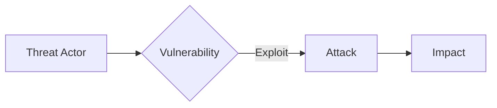

# Threat Model

---

## Threat Analysis

## Risk Calculation

$$Risk = Threat \times Vulnerability \times Impact$$

| Threat | Likelihood | Impact | Risk |
|--------|------------|--------|------|
| [Name] | [X] | [Y] | [X×Y] |

---

**Approved:** _________________ Date: _________
