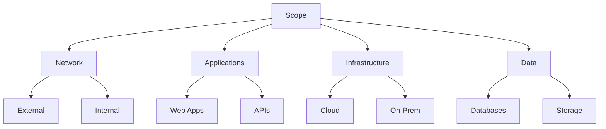
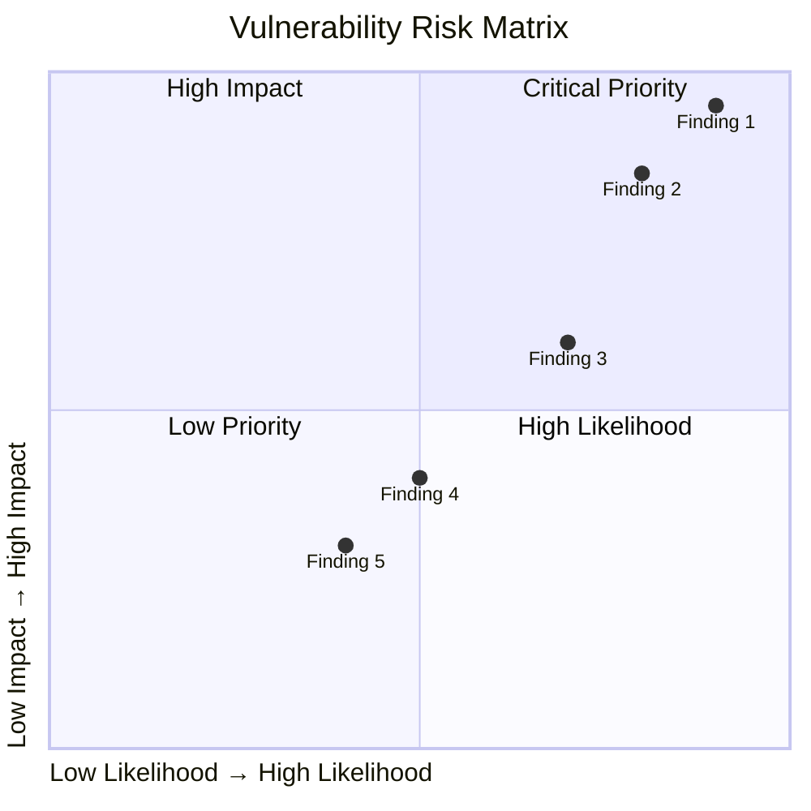

# Vulnerability Assessment Report

<!-- Security vulnerability findings and remediation -->

---

## Document Control

| Field               | Value                   |
| ------------------- | ----------------------- |
| **Assessment Date** | [DD-MMM-YYYY]           |
| **Scope**           | [System/Application]    |
| **Assessor**        | [Internal/Third-Party]  |
| **Classification**  | [Confidential/Internal] |
| **Version**         | [X.X]                   |

---

## Executive Summary

### Risk Summary

| Severity     | Count | Risk Score | Status   |
| ------------ | ----- | ---------- | -------- |
| **Critical** | [X]   | [X]        | [ ] Open |
| **High**     | [X]   | [X]        | [ ] Open |
| **Medium**   | [X]   | [X]        | [ ] Open |
| **Low**      | [X]   | [X]        | [ ] Open |
| **Info**     | [X]   | N/A        | N/A      |

$$Overall\ Risk = \frac{\sum(Severity_i \times Likelihood_i)}{n}$$

**Overall Risk Rating:** [Critical/High/Medium/Low]

---

## Assessment Scope



### In Scope

- [ ] External network perimeter
- [ ] Web applications
- [ ] APIs
- [ ] Cloud infrastructure
- [ ] Internal network
- [ ] Wireless networks
- [ ] Physical security
- [ ] Social engineering

### Out of Scope

- [ ] Third-party vendors
- [ ] Employee devices
- [ ] [Other exclusions]

---

## Methodology

| Phase                      | Activities                   | Tools        | Duration |
| -------------------------- | ---------------------------- | ------------ | -------- |
| **Reconnaissance**         | OSINT, footprinting          | [Tools]      | [X] days |
| **Scanning**               | Port scan, service detection | Nmap, Nessus | [X] days |
| **Enumeration**            | Version detection, config    | [Tools]      | [X] days |
| **Vulnerability Analysis** | CVE matching, validation     | [Tools]      | [X] days |
| **Exploitation**           | Controlled exploitation      | [Tools]      | [X] days |
| **Post-Exploitation**      | Privilege escalation, pivot  | [Tools]      | [X] days |
| **Reporting**              | Documentation, evidence      | [Tools]      | [X] days |

---

## Critical Findings

### Finding #1: [Title]

| Attribute      | Value            |
| -------------- | ---------------- |
| **Severity**   | Critical         |
| **CVSS Score** | [X.X]            |
| **CVE**        | [CVE-XXXX-XXXXX] |
| **Location**   | [System/URL]     |

**Description:**
[Detailed description of the vulnerability]

**Evidence:**

```
[Proof of concept or screenshot]
```

**Impact:**

- [ ] Data breach
- [ ] System compromise
- [ ] Privilege escalation
- [ ] [Other impact]

**Remediation:**

1. [ ] Step 1
2. [ ] Step 2
3. [ ] Step 3

**Timeline:** Immediate (within 7 days)

---

## High Findings

### Finding #2: [Title]

| Attribute      | Value        |
| -------------- | ------------ |
| **Severity**   | High         |
| **CVSS Score** | [X.X]        |
| **CWE**        | [CWE-XXX]    |
| **Location**   | [System/URL] |

**Description:**
[Detailed description]

**Evidence:**

```
[Evidence]
```

**Remediation:**

1. [ ] Step 1
2. [ ] Step 2

**Timeline:** Short-term (within 30 days)

---

## Medium Findings

### Finding #3: [Title]

| Attribute      | Value  |
| -------------- | ------ |
| **Severity**   | Medium |
| **CVSS Score** | [X.X]  |

**Description:**
[Description]

**Remediation:**

1. [ ] Step 1

**Timeline:** Medium-term (within 90 days)

---

## Low/Info Findings

| ID  | Finding | Severity | CVSS  | Remediation |
| --- | ------- | -------- | ----- | ----------- |
| 4   | [Title] | Low      | [X.X] | [Action]    |
| 5   | [Title] | Low      | [X.X] | [Action]    |
| 6   | [Title] | Info     | N/A   | [Action]    |

---

## Risk Heat Map



---

## Remediation Roadmap

```mermaid
gantt
    title Vulnerability Remediation Timeline
    dateFormat YYYY-MM-DD

    section Critical
    Finding 1     :crit, a1, {{DATE}}, 7d
    Finding 2     :crit, after a1, 7d

    section High
    Finding 3     :high, b1, {{DATE_PLUS_7}}, 23d
    Finding 4     :high, after b1, 23d

    section Medium
    Finding 5     :med, c1, {{DATE_PLUS_30}}, 60d
```

| Phase        | Timeframe  | Findings | Effort    |
| ------------ | ---------- | -------- | --------- |
| **Critical** | 0-7 days   | [X]      | [X] hours |
| **High**     | 7-30 days  | [X]      | [X] hours |
| **Medium**   | 30-90 days | [X]      | [X] hours |
| **Low**      | 90+ days   | [X]      | [X] hours |

---

## Recommendations

### Strategic

1. [ ] Implement vulnerability management program
2. [ ] Establish patching SLA
3. [ ] Deploy security monitoring
4. [ ] Conduct regular assessments

### Tactical

1. [ ] Patch critical vulnerabilities immediately
2. [ ] Review and update firewall rules
3. [ ] Implement WAF for web applications
4. [ ] Enable MFA where missing

### Process

1. [ ] Security training for developers
2. [ ] Secure SDLC adoption
3. [ ] Incident response plan update
4. [ ] Regular penetration testing

---

## Appendices

### Appendix A: Technical Details

[Detailed vulnerability information]

### Appendix B: Evidence

[Screenshots, logs, console output]

### Appendix C: Tools Used

[List of scanners and versions]

### Appendix D: CVSS Scoring

[Detailed CVSS calculations]

---

**Prepared By:**

Security Assessor: ********\_******** Date: ****\_****

**Approved By:**

CISO: ********\_******** Date: ****\_****

Risk Manager: ********\_******** Date: ****\_****
